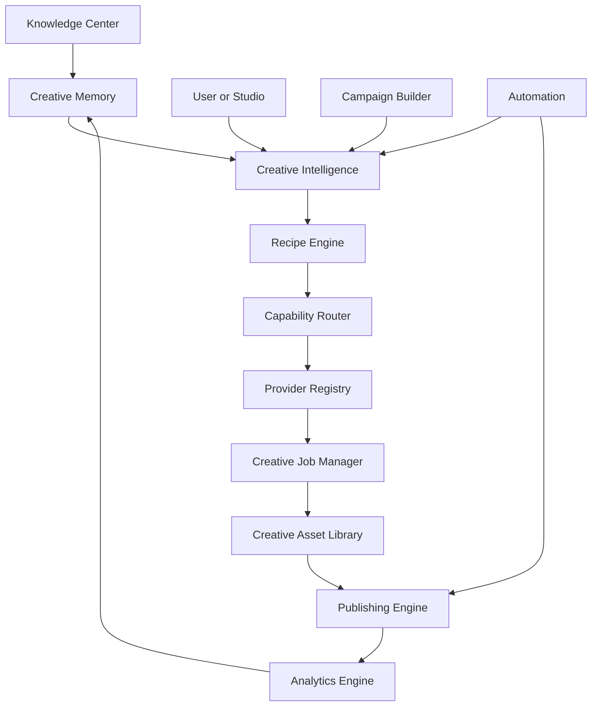

# MavenSync Creative Operating System Architecture v1

**Status:** Authoritative architecture specification

**Scope:** Long-term architecture for MavenSync Creative Studio and all future creative products.

**Audience:** Product architects, software engineers, platform engineers, workflow designers, provider integrators, and AI coding agents.

**Implementation posture:** This document defines responsibilities, contracts, ownership, and data flow. It does not require a framework replacement or a rewrite of existing systems.

## Architecture Library

This master document is the platform overview. Detailed subsystem responsibilities, contracts, and evolution guidance live in the [MavenSync Architecture Library](docs/architecture/README.md).

- [Design Principles](docs/architecture/Design_Principles.md)
- [Domain Model](docs/architecture/Domain_Model.md)
- [Roadmap](docs/architecture/Roadmap.md)
- [Studio Contract](docs/architecture/Studio_Contract.md)
- [Provider Contract](docs/architecture/Provider_Contract.md)
- [API Contracts](docs/architecture/API_Contracts.md)
- [Engine specifications](docs/architecture/README.md#engines)
- [Architecture Decision Records](docs/architecture/adr/README.md)

The master document remains the authoritative v1 overview. Focused documents are the maintainable implementation references and must remain consistent with this document.

## 1. Vision

MavenSync is a Creative Operating System: a platform that understands creative intent, reuses business and brand knowledge, plans creative work, selects appropriate capabilities, executes through interchangeable providers, manages asset lineage, publishes approved work, and learns from outcomes.

It is not a collection of disconnected AI tools because the system owns the relationships between:

- Business knowledge and creative decisions.
- Campaign intent and asset requirements.
- Recipes and provider capabilities.
- Jobs and generated assets.
- Assets and publishing destinations.
- Published work and performance analytics.

Studios are interfaces into this operating system. Image Studio, Video Studio, Marketing Studio, Audio, Workflow Studio, Voice Studio, and future products should gather intent and present results, but the operating system should own planning, routing, execution, provenance, and policy.

The canonical flow is:

```text
Knowledge Center
      ↓
Creative Memory
      ↓
Creative Intelligence
      ↓
Recipe Engine
      ↓
Capability Router
      ↓
Provider Registry
      ↓
Creative Jobs
      ↓
Creative Assets
      ↓
Publishing
      ↓
Analytics
```

## 2. Architectural Principles

### 2.1 Intent over implementation

Applications express what the user wants to accomplish. They do not express provider endpoints, vendor-specific model IDs, or transport details.

### 2.2 Knowledge is normalized

Knowledge Center content is transformed into typed, scoped, versioned context. Raw documents are not repeatedly attached to every provider request.

### 2.3 Creative Memory is reusable

Previously approved brand, voice, audience, product, visual, and campaign knowledge is reused before requesting or transmitting additional context.

### 2.4 Recipes describe creative intent

Recipes define tasks, roles, inputs, output requirements, style, context, quality, and policy preferences. Recipes do not hardcode provider payloads.

### 2.5 Providers are interchangeable

Provider adapters implement transport and capability contracts. Replacing or adding a provider must not require changes to studios, campaigns, or recipes.

### 2.6 Capability routing selects execution

The Capability Router selects eligible deployments based on required capability, quality, cost, latency, license, health, policy, and evidence freshness.

### 2.7 Every request becomes a Creative Job

Even a single synchronous-looking generation is represented as a job with identity, lifecycle, attempts, provenance, status, and results.

### 2.8 Every asset has lineage

Assets record their source job, recipe, model selection, prompt provenance, input assets, parent version, campaign role, and transformations.

### 2.9 Publishing is independent

Publishing consumes approved Creative Assets. It never regenerates creative content and never changes generation state.

### 2.10 Studios remain presentation layers

Studios collect inputs, submit requests, monitor jobs, render results, and expose actions. They do not own providers, routing, prompt compilation, persistence, or business policy.

### 2.11 Provider logic stays at the boundary

Provider-specific fields, authentication, polling, webhooks, errors, and response mapping stay inside Provider Registry adapters.

### 2.12 Business logic stays above providers

Campaign goals, approvals, brand rules, asset roles, budgets, and publishing decisions never live in a provider adapter.

### 2.13 Explicit provenance over implicit behavior

The system records why a recipe, capability, deployment, style, or provider was selected.

### 2.14 Safe degradation

Optional enrichment failures should preserve local work. Security, authorization, policy, and data-isolation failures should fail closed.

### 2.15 Configuration over branching

New capabilities, recipes, providers, deployments, styles, and policies should be introduced through validated configuration where possible.

### 2.16 Human control for consequential work

Expensive, public, irreversible, or brand-sensitive operations may require preview, approval, lock, or review before execution.

### 2.17 Deterministic boundaries

Each boundary has normalized inputs and outputs. Raw provider responses may be retained for diagnostics but cannot be required by downstream domains.

### 2.18 API efficiency is a product feature

Context projection, caching, batching, reuse, and selective provider calls are part of user experience and cost control.

## 3. Domain Model

### 3.1 Organization

**Purpose:** Top-level tenant and security boundary.

**Owns:** Workspaces, policies, billing/usage scope, provider allowlists, retention rules, and organization-wide Creative Memory.

**Lifecycle:** Created, active, suspended, archived.

### 3.2 Workspace

**Purpose:** Operational boundary for a team, brand, or business unit.

**Owns:** Projects, campaigns, recipes, assets, workflows, memory scopes, and publishing accounts.

**Relationship:** Belongs to an Organization; contains Users, Campaigns, Assets, and Workflows.

### 3.3 User

**Purpose:** Authenticated actor with permissions.

**Owns:** Personal preferences, drafts, approvals, saved recipes, and authored assets where applicable.

**Responsibilities:** Submit requests, approve work, manage permitted resources, and access authorized assets.

### 3.4 Knowledge Object

**Purpose:** Normalized representation of a source fact, document, brand rule, product fact, audience definition, or business instruction.

**Fields:** ID, type, source, content projection, scope, version, confidence, effective dates, permissions, and provenance.

**Lifecycle:** Ingested, normalized, approved, superseded, archived.

### 3.5 Creative Memory

**Purpose:** Reusable, structured context derived from Knowledge Objects and approved creative outcomes.

**Examples:** Brand voice, visual palette, audience, offer, character identity, product appearance, approved claims, platform preferences.

**Ownership:** Workspace, Campaign, or Organization depending on scope.

### 3.6 Recipe

**Purpose:** Versioned description of creative intent and execution requirements.

**Contains:** Task, inputs, outputs, prompt template, style references, capability requirements, quality/cost preferences, policies, and approval requirements.

**Lifecycle:** Draft, tested, active, deprecated, archived.

### 3.7 Capability

**Purpose:** Provider-neutral description of what an operation requires and produces.

**Examples:** Text-to-image, image editing, I2V, audio synthesis, lip sync, typography, product photography, speech recognition, voice synthesis, upscaling.

**Contains:** Modalities, constraints, parameter schema, output schema, quality dimensions, and support requirements.

### 3.8 Provider

**Purpose:** External or local execution transport.

**Contains:** Provider identity, transport kind, secret reference, request profiles, health, retry policy, and deployment bindings.

**Does not own:** Campaign logic, prompts, memory, approvals, or asset organization.

### 3.9 Creative Job

**Purpose:** Durable or in-memory execution unit created from a planned asset request.

**Contains:** Campaign/plan/request references, recipe, capability, selected deployment, attempts, state, provider job ID, result, error, and provenance.

**Lifecycle:** Pending, queued, running, completed, failed, retrying, cancelled, or domain-specific extensions.

### 3.10 Creative Asset

**Purpose:** Canonical reusable creative output or input reference.

**Contains:** Identity, generated files, thumbnails, prompt/style/model provenance, source inputs, campaign roles, collection membership, versions, metadata, and storage references.

**Lifecycle:** Created, materialized, reviewed, approved, published, superseded, archived, deleted.

### 3.11 Campaign

**Purpose:** Business container for a creative objective and its planned work.

**Contains:** Goal, objective, brand, audience, recipe/template, dates, status, tags, collections, approvals, assets, and metadata.

**Lifecycle:** Draft, planning, generating, review, approved, queued, completed, archived.

### 3.12 Workflow

**Purpose:** Reusable graph or sequence of creative operations.

**Contains:** Nodes, edges, input/output contracts, capability requirements, templates, versions, and validation rules.

**Lifecycle:** Draft, validated, published, deprecated, archived.

### 3.13 Publishing Job

**Purpose:** Delivery operation for an approved Creative Asset or campaign package.

**Contains:** Draft reference, destination account, platform capability, metadata variants, schedule, attempts, provider job ID, status, and result.

**Relationship:** References assets; does not regenerate them.

### 3.14 Analytics

**Purpose:** Outcome observations for assets, campaigns, publishing jobs, and audience responses.

**Contains:** Event, metric, dimension, source, timestamp, attribution, confidence, and aggregation period.

**Relationship:** Refers back to published assets and campaign intent without mutating creative provenance.

### 3.15 Automation

**Purpose:** External or internal trigger and action definition.

**Examples:** Webhook, n8n trigger, CRM event, campaign status transition, scheduled action, approval action.

**Contains:** Trigger, conditions, action recipe, credentials reference, idempotency policy, retry policy, and audit record.

## 4. System Context and Data Flow



### Standard generation flow

1. Studio or Campaign Builder submits a semantic request.
2. Authentication resolves Organization, Workspace, User, and policy.
3. Knowledge Engine resolves relevant normalized context.
4. Creative Memory projects only recipe-required context.
5. Creative Intelligence interprets intent and validates constraints.
6. Recipe Engine compiles prompt, style, inputs, outputs, and requirements.
7. Capability Router selects an eligible deployment.
8. Creative Job Manager creates a job and execution plan.
9. Provider Registry submits and tracks the provider operation.
10. Asset Library materializes and records outputs.
11. Studio receives canonical job/asset events.
12. Optional Publishing Engine consumes approved assets.
13. Analytics records outcomes and feeds future memory/evaluation.

## 5. Engine Specifications

### 5.1 Knowledge Engine

**Responsibilities**

- Ingest authorized source material.
- Normalize facts, rules, entities, and references.
- Classify scope and sensitivity.
- Track source provenance and versions.
- Expose typed context projections.

**Inputs:** Documents, project context, campaign context, user-provided facts, integrations.

**Outputs:** Knowledge Objects, normalized projections, source references, confidence scores.

**Internal data:** Parsers, extraction results, classifications, permissions, embeddings/index references where used.

**Dependencies:** Authentication, Workspace/Organization policy, storage/indexing.

**API boundary:** `GET/POST /knowledge/objects`, `GET /knowledge/projections`, `POST /knowledge/resolve`.

**Caching:** Normalized objects, projections, permission-filtered context, extraction results.

**Failure handling:** Preserve last approved projection; reject unauthorized access; mark stale context explicitly.

### 5.2 Creative Memory Engine

**Responsibilities:** Store and project reusable creative context from Knowledge Objects and approved creative outcomes.

**Inputs:** Knowledge projections, campaign results, user approvals, asset metadata.

**Outputs:** Recipe-scoped memory projection, memory confidence, provenance, invalidation signals.

**Internal data:** Memory facts, scopes, confidence, version graph, embeddings/index references, usage history.

**Dependencies:** Knowledge Engine, Asset Library, Recipe Engine, policy.

**API boundary:** `GET /memory`, `POST /memory/facts`, `POST /memory/project`, `POST /memory/invalidate`.

**Caching:** Aggressive cache by workspace/campaign/recipe/version; short TTL for volatile campaign facts.

**Failure handling:** Use last approved memory projection; never leak cross-workspace context.

### 5.3 Creative Intelligence Engine

**Responsibilities:** Interpret intent, select recipe, validate context, create asset requests, and coordinate planning.

**Inputs:** User intent, campaign, workflow, memory projection, constraints.

**Outputs:** Normalized Creative Request, Campaign Plan, asset requests, explanation, warnings.

**Internal data:** Intent classification, request normalization, policy decisions, prompt/style variables.

**Dependencies:** Memory, Recipe Engine, Capability Router, Campaign Builder.

**API boundary:** `POST /creative/interpret`, `POST /creative/plan`, `POST /creative/validate`.

**Caching:** Intent classification and recipe resolution when inputs/version hashes match.

**Failure handling:** Return actionable validation errors; preserve user instruction; degrade without optional context.

### 5.4 Recipe Engine

**Responsibilities:** Resolve versioned recipes and compile provider-neutral execution requests.

**Inputs:** Recipe ID/version, user variables, memory projection, styles, asset references.

**Outputs:** Compiled prompt, styles, capability requirements, input bindings, output specification, provenance.

**Internal data:** Templates, variable schema, style composition, capability weights, approval policies.

**Dependencies:** Memory, registry, policy, localization.

**API boundary:** `GET /recipes`, `POST /recipes/compile`, `POST /recipes/validate`.

**Caching:** Template versions, compiled prompt hashes, style compositions, capability profiles.

**Failure handling:** Reject missing or invalid variables before provider submission.

### 5.5 Capability Router

**Responsibilities:** Match a capability requirement to eligible deployments.

**Inputs:** Capability, output/input constraints, policy, cost/latency targets, provider health.

**Outputs:** Ranked Model Selection with reasons and evidence.

**Internal data:** Capability definitions, deployment metadata, scores, health, pricing, license rules.

**Dependencies:** Provider Registry, policy, usage/capacity data.

**API boundary:** `GET /capabilities`, `POST /routing/select`, `POST /routing/explain`.

**Caching:** Registry snapshots, capability matches, health state, cost estimates.

**Failure handling:** Use last-known-good registry; reject when no eligible deployment exists; record fallback decisions.

### 5.6 Provider Registry

**Responsibilities:** Register providers, deployments, capabilities, request profiles, authentication, health, and response mapping.

**Inputs:** Provider configuration, secrets, registry updates, normalized execution requests.

**Outputs:** Provider submission, status, cancellation, normalized result, provider errors.

**Internal data:** Provider adapters, request/response mappings, health/circuit state, retry policy.

**Dependencies:** Secret provider, HTTP/SDK transports, job manager.

**API boundary:** Internal `ProviderAdapter` port; external provider APIs remain hidden.

**Caching:** Health, model metadata, schemas, cost data.

**Failure handling:** Normalize errors, apply retry policy, circuit-break unhealthy providers, preserve provider attempt records.

### 5.7 Creative Job Manager

**Responsibilities:** Create, queue, execute, retry, cancel, checkpoint, and summarize Creative Jobs.

**Inputs:** Campaign Plan, Asset Requests, compiled recipe, Model Selection.

**Outputs:** Job state, attempts, progress events, results, asset references.

**Internal data:** Job state machine, dependencies, idempotency keys, attempts, checkpoints, locks.

**Dependencies:** Provider Registry, Asset Library, policy, event delivery.

**API boundary:** `POST /jobs`, `GET /jobs/:id`, `POST /jobs/:id/retry`, `POST /jobs/:id/cancel`, `GET /jobs/:id/events`.

**Caching:** Short-lived status cache; durable state remains authoritative.

**Failure handling:** Retry transient failures, isolate failed batch items, support recovery from checkpoints, never lose provenance.

### 5.8 Creative Asset Library

**Responsibilities:** Canonical asset identity, metadata, lineage, versions, collections, references, storage abstraction, and delivery.

**Inputs:** Uploads, provider outputs, job results, campaign relationships.

**Outputs:** Asset records, variants, thumbnails, signed delivery references, search results.

**Internal data:** Asset records, versions, relationships, tags, collections, storage object references.

**Dependencies:** Storage Registry, object storage, metadata processors, job manager.

**API boundary:** `POST/GET/PATCH/DELETE /assets`, `POST /assets/:id/clone`, `GET /assets/:id/download`.

**Caching:** Metadata, thumbnails, search indexes, signed URL cache within expiry.

**Failure handling:** Keep local metadata if materialization fails; retry storage operations; never make provider URL the sole durable identity.

### 5.9 Publishing Engine

**Responsibilities:** Validate, approve, schedule, submit, retry, and track publication of approved assets.

**Inputs:** Asset IDs, campaign, publishing draft, account, platform metadata.

**Outputs:** Publishing Jobs, Attempts, status, published URLs, errors.

**Internal data:** Accounts, drafts, platform capabilities, attempts, usage ledger.

**Dependencies:** Asset Library, Provider Registry publishing adapters, policy, scheduler/queue.

**API boundary:** `POST /publishing/drafts`, `POST /publishing/jobs`, `GET /publishing/jobs/:id`, `POST /publishing/jobs/:id/retry`.

**Caching:** Account capabilities and platform schemas.

**Failure handling:** Distinguish validation, auth, media, rate-limit, and provider failures; reconcile credits idempotently.

### 5.10 Workflow Engine

**Responsibilities:** Validate and execute reusable DAGs with typed inputs/outputs and asset/job lineage.

**Inputs:** Workflow definition, variables, asset references, capability requirements.

**Outputs:** Workflow Run, child jobs, outputs, assets, errors.

**Internal data:** Nodes, edges, topological layers, run state, node outputs, retries.

**Dependencies:** Recipe Engine, Capability Router, Job Manager, Asset Library.

**API boundary:** `POST /workflows/runs`, `GET /workflows/runs/:id`, `POST /workflows/runs/:id/retry`.

**Caching:** Validated workflow definitions, static node schemas, compiled execution plans.

**Failure handling:** Detect cycles, isolate failed nodes where possible, support partial retry and run recovery.

### 5.11 Analytics Engine

**Responsibilities:** Collect creative, job, publishing, and performance events; calculate attribution and feedback signals.

**Inputs:** Job events, asset events, publishing events, platform metrics, user feedback.

**Outputs:** Campaign metrics, recipe/model performance, cost/quality reports, learning signals.

**Internal data:** Events, aggregates, attribution links, evaluation scores, confidence.

**Dependencies:** All lifecycle engines, external analytics providers.

**API boundary:** `POST /analytics/events`, `GET /analytics/campaigns/:id`, `GET /analytics/models`.

**Caching:** Aggregated dashboards and time-window metrics.

**Failure handling:** Use append-only event ingestion; late events are reconciled; analytics failure never blocks asset generation.

## 6. Creative Memory Specification

Creative Memory is a scoped, reusable context system. It minimizes API usage by projecting only what a recipe needs.

### Memory domains

- **Brand Memory:** Name, positioning, visual identity, palette, typography, logo rules.
- **Voice Memory:** Tone, vocabulary, sentence length, emotional range, prohibited phrasing.
- **Audience Memory:** Segments, needs, sophistication, objections, channels.
- **Offer Memory:** Product/service facts, benefits, pricing policy, claims, differentiators.
- **Visual Memory:** Style tokens, lighting, composition, camera/lens preferences, references.
- **Character Memory:** Identity traits, appearance, wardrobe, voice, consistency references.
- **Product Memory:** Shape, materials, colors, dimensions, approved angles, reference assets.
- **Campaign Memory:** Goal, objective, brief, approved directions, prior outputs, learnings.
- **Platform Preferences:** Format, length, tone, safe zones, metadata conventions.
- **Approved Claims:** Verified language, evidence, expiration, scope.
- **Writing Preferences:** Formatting, CTA conventions, terminology, localization.

### Normalization

Each memory item has:

```text
memoryId
scope
type
value
sourceReferences
version
confidence
approved
effectiveFrom
effectiveUntil
updatedAt
```

Values should be structured where possible. For example, visual memory should contain palette tokens and lighting preferences rather than one opaque paragraph.

### Versioning

- Immutable revisions for approved facts.
- Current pointer per scope/type.
- Supersession relationships.
- Recipe provenance records the memory versions used.
- Campaign snapshots preserve the context used for historical output.

### Confidence scoring

Confidence combines:

- Source authority.
- Approval state.
- Recency.
- Cross-source agreement.
- User correction history.
- Extraction certainty.

Low-confidence memory may inform suggestions but must not silently constrain high-stakes output.

### Caching

Cache keys should include:

```text
organization/workspace/project/campaign scope
recipe ID/version
memory projection schema version
locale
policy version
```

Cache normalized projections, not raw unauthorized documents. Invalidate on approved memory changes, campaign changes, policy changes, or source revocation.

### Selective context projection

The Recipe Engine declares required memory domains. The Memory Engine returns only those domains:

```text
Product Hero Recipe
  -> product memory
  -> brand visual memory
  -> audience memory
  -> approved claims if text is rendered
```

The system should not send voice, billing, unrelated campaigns, or entire Knowledge Center collections for a product image.

### Synchronization

- Hub integrations publish normalized context changes.
- Creative Studio can request a fresh projection by version.
- Conflicts are resolved by scope and authority rules.
- User-approved creative decisions can be promoted into memory only through explicit workflows.

### Retention

- Retain approved memory according to Organization policy.
- Retain campaign snapshots for provenance.
- Expire temporary context projections.
- Remove revoked or deleted source material from future projections.
- Preserve audit records without retaining unnecessary raw content.

## 7. Studio Contract

Every studio follows the same execution model:

```text
Collect Inputs
      ↓
Request Creative Intelligence
      ↓
Receive Creative Job
      ↓
Monitor Progress
      ↓
Receive Creative Asset
      ↓
Optional Publish
```

### Studio responsibilities

- Collect user inputs and local UI state.
- Validate immediate interaction requirements.
- Submit a semantic request or Campaign Plan reference.
- Display job status and errors.
- Render canonical Creative Assets.
- Offer editing, retry, save, collection, and optional publish actions.

### Studio prohibitions

- Direct provider imports.
- Provider-specific model branching.
- Prompt template ownership.
- Storage implementation ownership.
- Campaign policy decisions.
- Publishing transport calls.

### Studio request contract

```text
CreativeRequest {
  requestId
  organizationId
  workspaceId
  userId
  campaignId?
  studioId
  recipeId
  intent
  inputs
  references
  output
  preferences
  idempotencyKey
}
```

### Studio response contract

```text
CreativeJobAccepted {
  jobId
  status
  estimatedCost?
  estimatedDuration?
  selectedCapability?
  selectedDeployment?
}
```

## 8. Provider Contract

Every provider adapter must expose a normalized contract.

### Provider identity

- Provider ID and version.
- Transport type.
- Environments and regions.
- Secret reference.
- Terms/license metadata.

### Capability declaration

- Supported input modalities.
- Supported output modalities.
- Capability IDs.
- Parameter schema.
- Constraints: resolution, duration, reference count, MIME, aspect ratio.
- Quality dimensions.
- Editing and consistency support.

### Execution operations

```text
submit(executionRequest)
getStatus(providerJob)
healthCheck()
estimateCost(request)
```

Optional:

```text
subscribe(providerJob)
materializeOutput(providerOutput)
```

### Metadata

- Pricing unit and estimate.
- Latency statistics.
- Quality evidence and evaluation date.
- Commercial-use/license class.
- Rate limits and concurrency.
- Retryable error classes.
- Deprecation/sunset date.

### Error contract

Normalize errors into:

- Authentication.
- Authorization.
- Validation.
- Rate limit.
- Capacity/unavailable.
- Timeout.
- Content policy.
- Billing.
- Provider internal.
- Unknown.

Provider adapters may retain raw diagnostics, but application domains use normalized errors.

## 9. Creative Job Lifecycle

```text
planned
  -> pending
  -> queued
  -> running
  -> materializing
  -> completed
```

Failure paths:

```text
running -> failed -> retrying -> queued
running -> cancelled
queued -> cancelled
```

### Planning

- Campaign Plan creates Asset Requests.
- Orchestrator converts requests into jobs.
- Dependencies and priority are validated.
- Cost and policy checks occur before submission.

### Execution

- Router selects deployment.
- Provider Registry submits.
- Provider job ID is stored.
- Status updates are normalized.

### Retries

- Retry only retryable errors.
- Create an attempt record per provider submission.
- Preserve failed attempt diagnostics.
- Apply maximum attempts and backoff.
- Fallback deployment must be recorded explicitly.

### Approvals

Approval may be required for:

- Public publishing.
- High-cost jobs.
- Sensitive brand claims.
- External tool calls.
- Open-ended multi-asset plans.

### Batching

- Each batch item receives its own job identity.
- Shared context may be cached.
- One item failure must not erase successful assets.
- Idempotency keys prevent duplicate provider charges.

### Checkpoints

Checkpoint plan and node state for workflows and dependent jobs. Recovery resumes from the last valid completed boundary.

### Lineage and provenance

Every job records:

- Request and Campaign Plan.
- Asset Request.
- Recipe/version.
- Memory projection/version.
- Capability and deployment selection.
- Provider attempt IDs.
- Input asset IDs.
- Output asset IDs.

### Cancellation and recovery

Cancellation is best effort at provider level but authoritative at application level. A cancelled job must not be accepted by downstream publishing. Recovery must reconcile provider completion that arrives after local cancellation.

## 10. Asset Lifecycle

```text
Creative Job
      ↓
Creative Asset
      ↓
Asset Library
      ↓
Publishing Draft
      ↓
Publishing Job
      ↓
Published Asset
      ↓
Analytics
```

### Asset creation

- Provider output is normalized.
- Output is validated by modality/MIME/size.
- Provider URL becomes a source reference, not the sole identity.
- Asset Manager creates canonical record.
- Materialization creates owned storage object when durable storage is enabled.

### Metadata

- Core identity and timestamps.
- Recipe/prompt/style/model provenance.
- Source job and provider attempt.
- Parent asset and version.
- Campaign role and collection.
- Dimensions, duration, MIME, size.
- Thumbnail and variant links.
- Memory/context provenance where appropriate.

### Versioning

Edits, upscales, crops, translations, aspect-ratio variants, and platform adaptations create child assets with explicit operation metadata and parent references.

### Publishing relationship

Publishing references Asset IDs and delivery policies. It may create platform-specific derivatives, but it must not mutate the source Creative Asset.

### Analytics relationship

Analytics links performance events to published asset, publishing job, campaign, recipe, and model selection. Attribution remains append-only and explainable.

## 11. API Contract

These are logical boundaries. Transport may be REST, internal RPC, events, or a client adapter.

### Creative Jobs

```text
POST   /creative/jobs
GET    /creative/jobs/:id
POST   /creative/jobs/:id/retry
POST   /creative/jobs/:id/cancel
GET    /creative/jobs/:id/events
```

Owns job lifecycle, attempts, progress, and results.

### Recipes

```text
GET    /creative/recipes
GET    /creative/recipes/:id
POST   /creative/recipes/:id/validate
POST   /creative/recipes/:id/compile
```

Owns versioned intent definitions and compilation.

### Providers and capabilities

```text
GET    /creative/providers
GET    /creative/capabilities
POST   /creative/capabilities/resolve
POST   /creative/routing/explain
```

Owns registry visibility and routing explanation, not raw secrets.

### Assets

```text
POST   /creative/assets
GET    /creative/assets
GET    /creative/assets/:id
PATCH  /creative/assets/:id
POST   /creative/assets/:id/clone
DELETE /creative/assets/:id
POST   /creative/assets/:id/download
```

### Memory

```text
GET    /creative/memory
POST   /creative/memory/facts
POST   /creative/memory/project
POST   /creative/memory/invalidate
```

### Campaigns and plans

```text
POST   /creative/campaigns
GET    /creative/campaigns/:id
PATCH  /creative/campaigns/:id
POST   /creative/campaigns/:id/plan
POST   /creative/campaigns/:id/execute
```

### Workflows

```text
GET    /creative/workflows
POST   /creative/workflows/validate
POST   /creative/workflows/runs
GET    /creative/workflows/runs/:id
POST   /creative/workflows/runs/:id/retry
```

### Publishing

```text
POST   /creative/publishing/drafts
POST   /creative/publishing/drafts/:id/approve
POST   /creative/publishing/jobs
GET    /creative/publishing/jobs/:id
POST   /creative/publishing/jobs/:id/retry
```

### Analytics

```text
POST   /creative/analytics/events
GET    /creative/analytics/campaigns/:id
GET    /creative/analytics/assets/:id
GET    /creative/analytics/models
```

## 12. Implementation Roadmap

### Phase 1: Creative Intelligence Core

**Goals:** Stabilize request, recipe, context, asset, and job contracts.

**Dependencies:** Existing intelligence layer, Campaign Builder, Asset Manager, Provider Registry.

**Expected outcomes:** Thin studio contract, canonical request normalization, recipe provenance, basic job/asset lineage.

**Completion criteria:** All active studios submit provider-neutral requests; contract tests cover request-to-asset flow; no new studio imports provider transport.

### Phase 2: Capability Router

**Goals:** Add capability definitions, deployment metadata, weighted routing, cost/latency/license filters.

**Dependencies:** Provider Registry and model capability matrix.

**Expected outcomes:** Explainable model selection and fallback.

**Completion criteria:** Routing fixtures cover image, video, audio, voice, editing, quality, cost, and license policies.

### Phase 3: Creative Jobs

**Goals:** Make job lifecycle durable and recoverable.

**Dependencies:** Router, Provider Registry, Asset Library.

**Expected outcomes:** Attempts, retries, checkpoints, idempotency, events, cancellation.

**Completion criteria:** Worker/process restart recovery, partial batch retry, normalized provider errors, and job provenance tests.

### Phase 4: Creative Asset Library

**Goals:** Materialize owned assets and unify studio histories.

**Dependencies:** Asset Manager, Storage Registry, job lineage.

**Expected outcomes:** Canonical asset search, versions, collections, variants, thumbnails, signed delivery.

**Completion criteria:** Generated, uploaded, edited, workflow, and imported assets all resolve to canonical records.

### Phase 5: Creative Memory

**Goals:** Normalize Knowledge Center context into scoped reusable memory.

**Dependencies:** Knowledge Engine, Recipe Engine, policy.

**Expected outcomes:** Brand, audience, product, voice, visual, and campaign projections with confidence/versioning.

**Completion criteria:** Recipe-specific context projection avoids unrelated context and preserves provenance.

### Phase 6: Workflow Studio

**Goals:** Support typed nodes, generic schema nodes, dependencies, chaining, multi-reference inputs, preview, and partial retry.

**Dependencies:** Jobs, router, assets, recipes.

**Expected outcomes:** Reusable creative workflow execution with node-level lineage.

**Completion criteria:** Workflow runs produce child jobs/assets and recover from partial node failure.

### Phase 7: Publishing

**Goals:** Build independent publishing drafts, accounts, jobs, attempts, approvals, queues, and settlement.

**Dependencies:** Asset Library, policy, Provider Registry publishing adapters, scheduler infrastructure.

**Expected outcomes:** Approved assets publish without regeneration and with auditable retries.

**Completion criteria:** Account isolation, platform validation, idempotent settlement, webhook/polling fallback, and publishing history.

### Phase 8: Voice Studio

**Goals:** Add streaming STT/TTS, voice recipes, turn state, memory, interruption, and tool approval.

**Dependencies:** Creative Memory, Recipe Engine, Provider Registry, Job/asset contracts.

**Expected outcomes:** Voice-to-brief, support/sales agents, narration, and voice-controlled creative planning.

**Completion criteria:** Streaming turn tests, barge-in behavior, persona/version provenance, and tool approval audit.

## 13. Engineering Rules

1. Studios never communicate directly with providers.
2. Providers never contain business logic.
3. Knowledge is always normalized before use.
4. Creative Memory is reused before requesting additional context.
5. Memory projections are recipe-scoped and permission-filtered.
6. Provider selection is capability-driven.
7. Model rankings are recipe-specific, evidence-backed, and freshness-aware.
8. Every generation becomes a Creative Job.
9. Every provider attempt is recorded.
10. Every asset records provenance and lineage.
11. Publishing never regenerates content.
12. Publishing references Asset IDs, not transient URLs alone.
13. Recipes define intent, not provider payloads.
14. Provider-specific fields remain inside adapters.
15. Workflow nodes use typed input/output contracts.
16. Campaign Plans describe intended work; Creative Jobs describe execution.
17. Creative Assets describe durable outputs; Publishing Jobs describe delivery.
18. Automation triggers are idempotent.
19. Retries are error-classified and bounded.
20. Human approval is required for configured consequential operations.
21. External context must not override system or policy instructions.
22. Raw provider responses may be retained for diagnostics but never required downstream.
23. Storage is accessed through adapters and registries.
24. API keys and provider secrets never enter browser-visible domain records.
25. Analytics is append-oriented and must not block creative execution.
26. New providers must be addable without modifying studios.
27. New recipes must be addable without modifying provider transports.
28. New studios must implement the standard job/asset contract.
29. Legacy compatibility paths must be explicit and removable.
30. Architecture changes require contract tests before feature work.

## 14. Definition of Architectural Readiness

MavenSync is ready for large-scale Creative OS implementation when:

- Every active studio submits canonical semantic requests.
- Capability routing can explain every deployment choice.
- Creative Memory projects only necessary context.
- Jobs survive retries, restarts, and provider changes.
- Assets have durable identity and lineage.
- Workflows produce traceable child jobs and assets.
- Publishing is independent and approval-controlled.
- Voice uses the same recipe/job/asset contracts.
- Analytics can attribute outcomes to campaign, recipe, model, and asset.
- Adding a provider or recipe does not require studio rewrites.

## 15. Living Documentation Policy

Whenever a feature changes system architecture:

1. Update the relevant document in `docs/architecture/`.
2. Update this master document when the platform-wide overview changes.
3. Update `BUILD_STATUS.md` if a milestone or implementation status changes.
4. Commit architecture documentation together with the implementation changes it describes.
5. Create or update an ADR when the decision changes a durable boundary, lifecycle, security rule, storage contract, provider contract, or API.

Architecture and implementation must remain synchronized.

## 16. Current-State References

The following documents describe existing implementation and migration constraints. They remain separate from the target architecture:

- [Asset Architecture Audit](docs/ASSET_ARCHITECTURE.md)
- [MavenSync Hub Integration](docs/MAVENSYNC_INTEGRATION.md)
- [Design Agent and Workflow Integration](docs/DESIGN_WORKFLOW_INTEGRATION.md)
- [MuAPI Publishing Foundation](docs/MUAPI_PUBLISHING.md)
