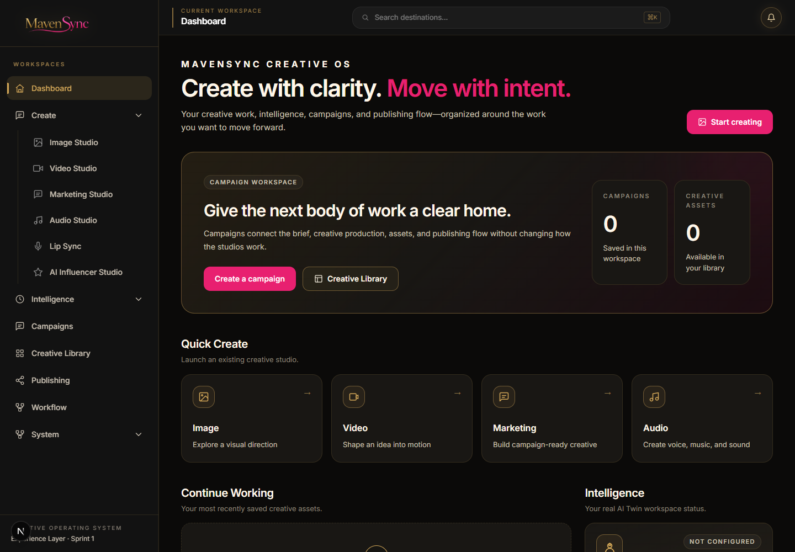
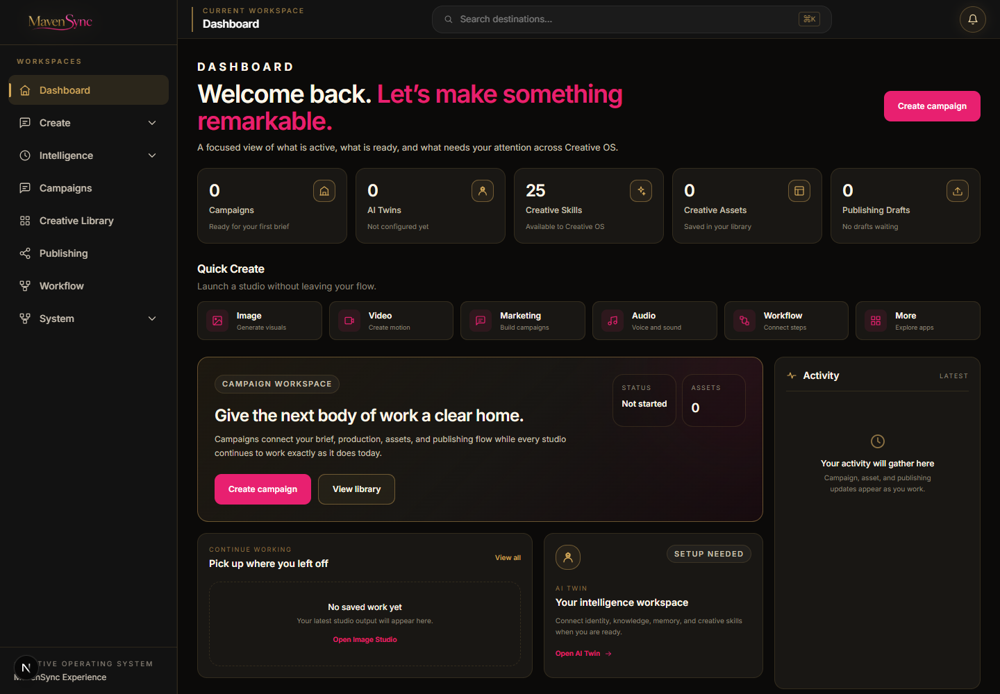
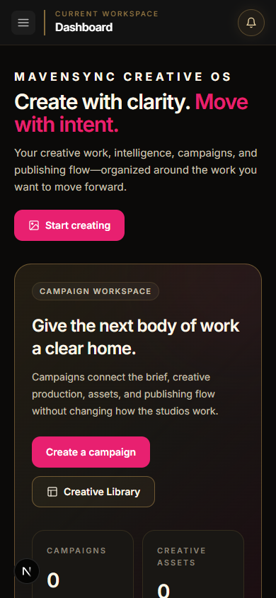

# Milestone — MavenSync Experience Layer Sprint 2 Dashboard

Date: 2026-08-05  
Branch: `mavensync-integration`  
Repository: `C:\Users\Martha Newell\Downloads\AI-Apps\open-generative-ai`  
Status: Complete

## Outcome

Redesigned only the MavenSync Creative OS Dashboard and shared shell presentation using the supplied approved mockup as the canonical visual reference. The result moves from the spacious Sprint 1 proof toward a denser premium command-center composition while retaining the certified architecture, workspace hierarchy, routes, data stores, and application behavior.

No AI Twin, Agent, Campaign, Publishing, Workflow, or studio internals were redesigned.

## Before and after

### Desktop — 1440×1000

| Before | After |
| --- | --- |
|  |  |

### Mobile — 390×844

| Before | After |
| --- | --- |
|  |  |

Browser captures were made through the real `/studio` route with the same empty local workspace state. The After view therefore shows honest zero/empty states rather than seeded demo content.

## Design decisions

### Composition and density

- Replaced the oversized headline/hero rhythm with a compact command-center header.
- Added a five-card metric strip modeled on the reference's immediate workspace overview.
- Converted Quick Create into a shallow six-launcher row rather than large promotional cards.
- Made Current Campaign the primary horizontal focal card.
- Added a persistent Activity rail that merges real campaign, asset, and publishing events by timestamp.
- Balanced Continue Working and AI Twin summary cards beneath the campaign focal area.
- Added explicit Recent Assets and Publishing summaries at the bottom of the dashboard.

### Visual language

- Preserved matte black, warm charcoal, metallic gold structure, MavenSync pink actions, warm white, and soft gray.
- Reduced radii and shadow depth to match the reference's professional information density.
- Restricted pink to primary actions, creative launcher icons, and directional links.
- Kept gradients faint and localized; no glass panels or neon treatments were introduced.
- Maintained Inter and the existing font stack.

### Sidebar and shell

- Preserved the Sprint 1 workspace architecture and all eight top-level workspaces.
- Collapsed Create, Intelligence, and System by default on Dashboard so specialized applications are not exposed as equal top-level items.
- Direct studio routes automatically expand the relevant group as before.
- Tightened desktop sidebar width from 18rem to 16rem, reduced logo/header height, and compacted navigation rhythm.
- Retained the existing mobile drawer, overlay, Command Bar, notifications, campaign header context, and settings behavior.

## Real data used

- Campaign count, active/recent campaign, status, and campaign-associated assets from `CampaignStore`, `CampaignContext`, and existing asset metadata.
- AI Twin count from `listTwins()`.
- Creative Skills count from the actual frozen `SKILL_LIBRARY` (25 in the validation workspace).
- Creative Asset count, Continue Working, and Recent Assets from `localAssetManager`.
- Publishing drafts and history from `readPublishingDrafts()` and `readPublishingHistory()`.
- Activity from existing campaign, asset, and publishing timestamps.

No fake metrics, mock campaigns, example assets, invented progress values, or new features were added.

## Components refined

- `MavenSyncDashboard` — complete dashboard composition refinement.
- `ExperiencePage` — denser page padding and wider professional working canvas.
- `WorkspaceHeader` — compact title/description/action rhythm.
- `WorkspaceHero` — shallower campaign-focused hero proportions.
- `WorkspaceSection` — tighter vertical grouping.
- `WorkspaceCard` — smaller standard padding and refined elevation.
- Global Experience tokens — heading scale, radii, and shadow refinement.
- `StandaloneShell` — compact workspace sidebar and header chrome.

## Accessibility

- Semantic heading hierarchy remains ordered from one page `h1` through section `h2` labels.
- Workspace metrics use an accessible labeled region and remain actionable links.
- Empty dashboard areas contain explanatory copy and real navigation actions.
- Mobile navigation button remains keyboard and screen-reader accessible.
- Existing gold `:focus-visible` outlines remain global.
- Existing `prefers-reduced-motion` behavior remains intact.
- Decorative SVG icons are `aria-hidden`; image previews use empty alt text because adjacent text names the asset.
- Desktop, mobile, and mobile-drawer browser snapshots completed with 0 console errors and 0 warnings.

## Functionality preserved

- All 22 registered tabs remain mapped to the Sprint 1 workspace architecture.
- All 22 `/studio/{tabId}` direct routes returned HTTP 200 after a clean server launch.
- Command Bar registry and intent tests remain unchanged and pass.
- `/studio` remains the dashboard; `/studio/asset-library` remains the direct library route.
- No route identifiers, provider calls, Campaign Context behavior, AI Twin logic, Agent logic, Creative Intelligence, generation behavior, asset persistence, publishing execution, or workflow behavior changed.

## Validation

| Check | Result |
| --- | --- |
| Root `npm test` script | Not defined in `package.json` |
| Actual repository Node tests | 710 passed, 0 failed across 68 files |
| `npm run build:studio` | Passed; Tailwind build and 300 Babel files compiled |
| `npm run build` | Passed; optimized Next.js production build and validity checks completed |
| Workspace registry | 22 registered, 22 mapped, 0 missing |
| Direct route smoke test | 22/22 HTTP 200 |
| Desktop browser QA | Passed at 1440×1000 |
| Mobile browser QA | Passed at 390×844 |
| Mobile workspace drawer | Opened successfully and remained usable |
| Browser console | 0 errors, 0 warnings |
| Reduced motion | Existing global preference override preserved |
| Keyboard focus | Existing global gold focus-visible treatment preserved |

Expected resilience-test logs for corrupt storage and unavailable MavenSync Hub connections remain; those assertions pass and do not represent browser console errors.

## Files changed for Sprint 2

- `app/globals.css`
- `components/StandaloneShell.js`
- `packages/studio/src/components/experience/ExperienceComponents.jsx`
- `packages/studio/src/components/experience/MavenSyncDashboard.jsx`
- `docs/experience/MAVENSYNC_EXPERIENCE_DESIGN_SYSTEM.md`
- `docs/assets/experience-sprint2-dashboard-before-desktop.png`
- `docs/assets/experience-sprint2-dashboard-after-desktop.png`
- `docs/assets/experience-sprint2-dashboard-before-mobile.png`
- `docs/assets/experience-sprint2-dashboard-after-mobile.png`
- `docs/milestones/MILESTONE_2026-08-05_Experience_Layer_Sprint2_Dashboard.md`
- `BUILD_STATUS.md`

## Recommended next step

Stop here and request design approval before applying this visual standard to another workspace. Suggested next sprint after approval: a Create workspace landing page using the same metric/launcher/card density, without redesigning individual studios.

## Recommended commit message

`feat(experience): redesign MavenSync dashboard from approved reference`
