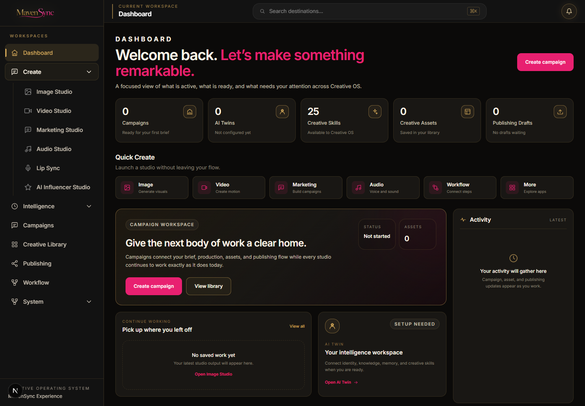
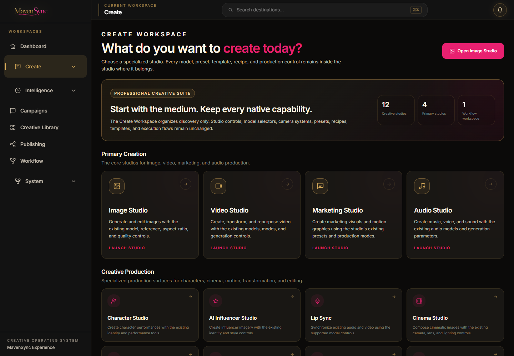
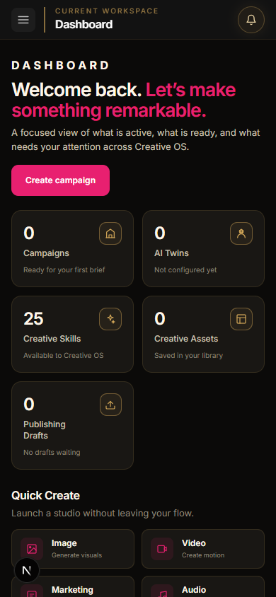
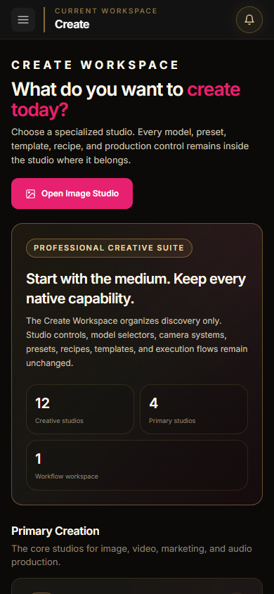

# Milestone — MavenSync Experience Layer Sprint 3 Create Workspace

Date: 2026-08-05  
Branch: `mavensync-integration`  
Repository: `C:\Users\Martha Newell\Downloads\AI-Apps\open-generative-ai`  
Status: Complete

## Outcome

Created a premium Create Workspace launcher at `/studio/create` using the approved MavenSync Experience design language. The page answers “What do you want to create today?” with a clear hierarchy for the four primary studios, eight specialized production studios, and the existing Workflow workspace.

This sprint changes presentation and discovery only. It does not redesign a studio, change a route, alter generation behavior, or modify the certified Creative Intelligence Engine, Provider Registry, Campaign Context, AI Twin logic, Agent logic, asset persistence, publishing logic, or Command Bar behavior.

## Before and after

### Desktop — 1440×1000

| Before | After |
| --- | --- |
|  |  |

### Mobile — 390×844

| Before | After |
| --- | --- |
|  |  |

The Before captures show the prior Create discovery state in the shared shell. The After captures show the real `/studio/create` route in the same local environment. No sample projects, generated assets, or fabricated activity were introduced.

## Workspace layout decisions

- Added one shallow Create landing page instead of placing technical studio controls in a launcher.
- Gave Image Studio, Video Studio, Marketing Studio, and Audio Studio the strongest card hierarchy under Primary Creation.
- Grouped the eight remaining registered Create destinations under Creative Production.
- Kept Workflows as its existing top-level workspace and added a single discovery card under Workflow Tools; its route and internals remain unchanged.
- Used direct, visible launch actions without nested launcher menus.
- Reused the Sprint 1 semantic tokens and Sprint 2 density, spacing, typography, matte-black surfaces, charcoal cards, metallic-gold structure, and pink primary action treatment.
- Made `/studio/create` the clickable Create workspace label while retaining the expandable sidebar list of native studio destinations.

## Existing studios preserved

| Group | Existing destination | Route |
| --- | --- | --- |
| Primary Creation | Image Studio | `/studio/image` |
| Primary Creation | Video Studio | `/studio/video` |
| Primary Creation | Marketing Studio | `/studio/marketing` |
| Primary Creation | Audio Studio | `/studio/audio` |
| Creative Production | Character Studio | `/studio/character` |
| Creative Production | AI Influencer Studio | `/studio/ai-influencer` |
| Creative Production | Lip Sync | `/studio/lipsync` |
| Creative Production | Cinema Studio | `/studio/cinema` |
| Creative Production | Vibe Motion | `/studio/vibe-motion` |
| Creative Production | Body Swap | `/studio/body-swap` |
| Creative Production | AI Clipping | `/studio/clipping` |
| Creative Production | Design Agent | `/studio/design-agent` |
| Workflow Tools | Workflows | `/studio/workflows` |

Names and URLs come from the existing repository navigation. No replacement names or routes were invented.

## Existing templates and native capabilities preserved

- No individual studio component or studio-internal control was edited.
- Image model choices, image-edit inputs, references, aspect ratios, and quality controls remain in Image Studio.
- Video models, create/transform modes, repurpose behavior, inputs, and output controls remain in Video Studio.
- Marketing production modes, presets, and Motion Graphics remain in Marketing Studio.
- Audio models and generation parameters remain in Audio Studio.
- Character identity and performance-transfer tools remain in Character Studio; Body Swap retains its existing identity, driving-video, and model controls.
- Cinema camera, lens, lighting, and image-generation controls remain inside Cinema Studio.
- AI Influencer, Lip Sync, Vibe Motion, AI Clipping, and Design Agent retain their existing selectors, inputs, sessions, and execution paths.
- Workflow graph editing, saved workflows, node schemas, execution controls, and all ten registered motion workflow templates remain in Workflows.
- Existing recipes, provider selections, generation options, camera movements, and presets remain in their original registries and studio surfaces.

## Components reused

- `ExperiencePage` for the responsive working canvas.
- `WorkspaceHeader` for the page question, description, and primary launch action.
- `WorkspaceHero` for the compact orientation panel.
- `WorkspaceSection` for the three launcher groups.
- `WorkspaceCard` for both primary and compact launcher cards.
- `PrimaryButton` and `StatusBadge` for existing Experience action and status treatments.
- `StandaloneShell` for the existing sidebar, mobile drawer, header, Command Bar, notifications, campaign context, and content mount behavior.

The new `MavenSyncCreateWorkspace` component composes these existing primitives; it contains no data mutation, provider call, generation workflow, or persistence logic.

## Accessibility validation

- One page-level `h1` clearly states the Create question; section headings and card headings follow a semantic hierarchy.
- Every studio launcher is a native link with a visible name and descriptive accessible text.
- Decorative SVGs are hidden from assistive technology.
- Create sidebar expansion exposes an `aria-expanded` state and explicit expand/collapse label.
- The mobile navigation toggle remains keyboard and screen-reader accessible.
- Existing high-visibility `:focus-visible` styling and reduced-motion preference handling remain unchanged.
- Desktop and mobile accessibility snapshots exposed all launchers and destinations by role.
- Browser validation reported 0 console errors and 0 warnings.

## Build and behavior validation

| Check | Result |
| --- | --- |
| Sprint 1 deliverables | Verified present before implementation |
| Sprint 2 deliverables | Verified present before implementation |
| Root `npm test` script | Not defined in `package.json` |
| Actual repository Node tests | 710 passed, 0 failed |
| `npm run build:studio` | Passed; Tailwind build and 301 Babel files compiled |
| `npm run build` | Passed; optimized Next.js production build and validity checks completed |
| Create and launcher route smoke test | 14/14 HTTP 200 (`/studio/create`, 12 studios, Workflows) |
| Launcher target inspection | All cards expose their existing direct route |
| Command Bar | `Control+K` opened the unchanged destination list from `/studio/create` |
| Desktop browser QA | Passed at 1440×1000 |
| Mobile browser QA | Passed at 390×844 |
| Mobile workspace drawer | Opened successfully and exposed existing workspace links |
| Browser console | 0 errors, 0 warnings |

Expected resilience-test logs for corrupt storage and unavailable MavenSync Hub connections remain; those assertions pass and do not represent browser console errors.

## Files changed for Sprint 3

- `components/StandaloneShell.js`
- `packages/studio/src/components/experience/MavenSyncCreateWorkspace.jsx`
- `packages/studio/src/index.js`
- `packages/studio/src/studioNavigation.js`
- `docs/assets/experience-sprint3-create-before-desktop.png`
- `docs/assets/experience-sprint3-create-after-desktop.png`
- `docs/assets/experience-sprint3-create-before-mobile.png`
- `docs/assets/experience-sprint3-create-after-mobile.png`
- `docs/milestones/MILESTONE_2026-08-05_Experience_Layer_Sprint3_Create_Workspace.md`
- `BUILD_STATUS.md`

## Definition of Done

- [x] The Create Workspace uses the approved Experience Layer visual system.
- [x] The page immediately asks what the user wants to create.
- [x] Every registered Create studio remains directly accessible.
- [x] Workflow tools remain accessible through the existing route.
- [x] Existing templates, presets, recipes, workflows, camera controls, model selections, and generation options remain inside their respective studios.
- [x] No studio internals, business logic, routes, provider behavior, persistence, publishing logic, AI Twin logic, Agent logic, or Command Bar behavior changed.
- [x] Desktop and mobile layouts were verified in a real browser.
- [x] Accessibility structure, mobile navigation, and console state were verified.
- [x] Studio build, production build, and complete test suite pass.
- [x] Before/After screenshots and implementation evidence are recorded.

## Approval gate

Sprint 3 stops here. Do not redesign another workspace until the Create Workspace receives approval.

## Recommended commit message

`feat(experience): add premium Create workspace launcher`
