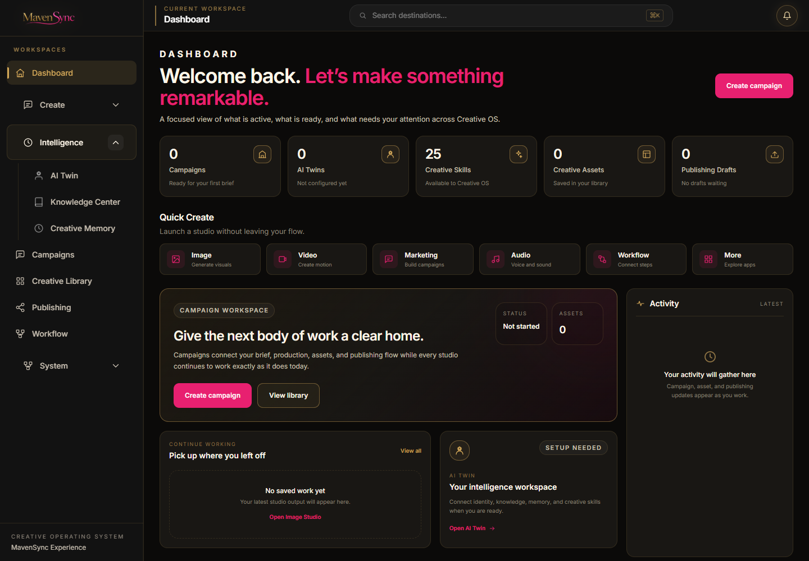
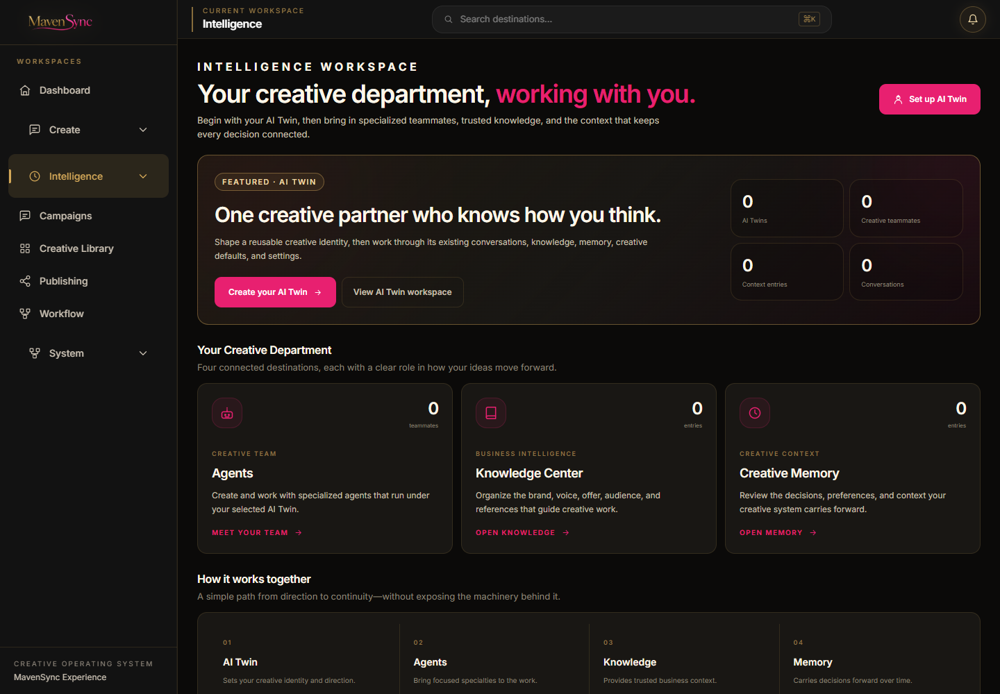
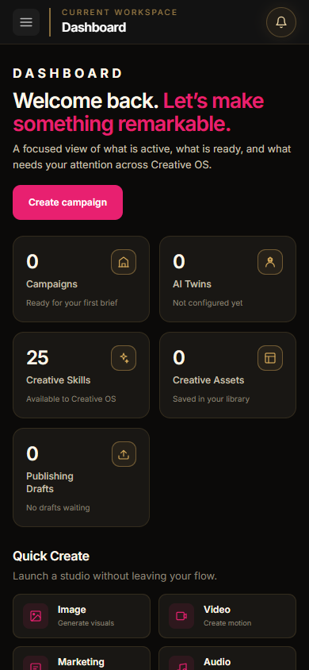
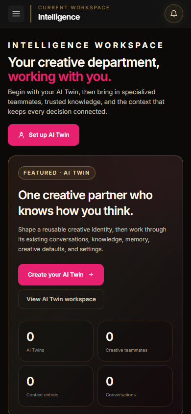

# Milestone — MavenSync Experience Layer Sprint 4 Intelligence Workspace

Date: 2026-08-05  
Branch: `mavensync-integration`  
Repository: `C:\Users\Martha Newell\Downloads\AI-Apps\open-generative-ai`  
Status: Complete

## Outcome

Created a premium Intelligence Workspace landing page at `/studio/intelligence`. It presents AI Twin, Agents, Knowledge Center, and Creative Memory as one personal creative department rather than four disconnected tools.

AI Twin is the focal point and clearest starting place. Agents are presented as the creative team, Knowledge Center as business intelligence, and Creative Memory as the context that carries decisions forward. A short relationship map explains how the four destinations work together without exposing backend implementation details.

This sprint changes presentation and discovery only. No AI Twin, Agent, Knowledge Center, Creative Memory, Creative Intelligence, Campaign Context, Provider Registry, routing, persistence, command, conversation, template, or settings logic was changed.

## Before and after

### Desktop — 1440×1000

| Before | After |
| --- | --- |
|  |  |

### Mobile — 390×844

| Before | After |
| --- | --- |
|  |  |

The Before state shows Intelligence available only through the expandable shared navigation. The After state shows the real `/studio/intelligence` landing page in the same empty local workspace. Zero values and the Continue Working empty state are honest; no example activity, fake conversations, sample Twins, or sample Agents were created.

## Layout decisions

- Led with “Your creative department, working with you” to communicate partnership rather than tool inventory.
- Made AI Twin the Featured focal card with the primary setup/continue action.
- Used the existing persisted stores for AI Twin, Agent, Creative Memory, and conversation counts.
- Organized the supporting destinations by user-facing role: Creative Team, Business Intelligence, and Creative Context.
- Added a four-step relationship strip—AI Twin, Agents, Knowledge, Memory—to explain the experience in plain language.
- Added Continue Working using only existing AI Twin and Agent conversations, sorted by their real timestamps.
- Used an explanatory empty state when no prior conversations exist.
- Kept the workspace-first sidebar introduced in Sprint 3. Intelligence is now a clickable workspace destination and remains expandable to its existing tools.
- Reused the established matte-black canvas, charcoal surfaces, metallic-gold structure, MavenSync pink actions, strong typography, restrained glow, compact radii, and responsive spacing.

## Existing functionality preserved

### AI Twin

- Existing AI Twin creation, blueprints, identity, assets, conversations, memory, knowledge bindings, creative defaults, voice profiles, and settings remain inside `/studio/ai-twin`.
- Existing conversation records, pins, favorites, campaign context, and per-Twin isolation remain unchanged.
- The landing reads counts and recent conversation metadata only; it does not write Twin state.

### Agents

- Existing featured templates, Agent creation/editing, specialties, categories, prompts, Twin selection, chats, and runtime behavior remain inside `/studio/agents`.
- Existing Agent conversations and their Twin attribution remain unchanged.
- The landing reads Agent and chat metadata only; it does not run or configure an Agent.

### Knowledge Center

- Existing brand DNA, voice, offer, audience, authority, frameworks, repositories, campaign knowledge, and connected-memory presentation remains inside `/studio/knowledge-center`.
- No new knowledge-management interface was added.

### Creative Memory

- Existing memory types, scopes, statuses, recent memory, campaign memory, brand decisions, creative decisions, preferences, sources, learned patterns, archives, statistics, and health remain inside `/studio/memory`.
- Existing Creative Memory storage and logic were not changed.

### Shared behavior

- Existing navigation entries, commands, routes, templates, conversations, and settings remain available.
- The local Agency-mode allowed-tab configuration includes the existing `agents` tab, correcting a pre-existing fallback that otherwise sent `/studio/agents` to Image Studio; no Agent or routing code changed.
- The existing Command Bar registry and behavior were not edited.
- Creative Skill Packs and Creative Intelligence implementation details are not exposed by the landing page.
- No capability was moved out of its existing tool.

## Real data used

- AI Twin count from `listTwins()`.
- Agent count from `listAgents()`.
- Context-entry count from the existing `MemoryStorageAdapter`.
- Conversation count from existing AI Twin conversations and Agent chats.
- Continue Working from existing AI Twin and Agent conversation titles, owners, and timestamps.

All reads occur client-side through existing persistence helpers. Read failure degrades to the same honest empty state; no fallback data is fabricated.

## Components reused

- `ExperiencePage` for the responsive workspace canvas.
- `WorkspaceHeader` for the workspace promise and primary AI Twin action.
- `WorkspaceHero` for the Featured AI Twin focal area and factual summary.
- `WorkspaceSection` for department, relationship, and recent-work grouping.
- `WorkspaceCard` for destinations, relationship guidance, and recent conversations.
- `PrimaryButton` and `StatusBadge` for existing action and status treatments.
- `StandaloneShell` for the existing workspace navigation, mobile drawer, header, Command Bar, notifications, campaign context, and content mounting behavior.

The new `MavenSyncIntelligenceWorkspace` composes these primitives and reads existing stores. It contains no runtime, generation, provider, persistence, or management behavior.

## Accessibility validation

- One page-level `h1` communicates the workspace promise; sections and cards use an ordered heading hierarchy.
- All four Intelligence destinations are native links with descriptive visible text.
- AI Twin actions use clear setup/continue language based on real persisted state.
- Summary values are grouped under the accessible label “Intelligence workspace summary.”
- Destination counts include visible contextual labels such as teammates and entries.
- Decorative SVG icons are hidden from assistive technology.
- The Intelligence sidebar disclosure retains explicit expand/collapse labels and `aria-expanded` state.
- Existing focus-visible and reduced-motion treatments remain unchanged.
- Desktop and mobile accessibility snapshots exposed the full page and its destinations by role.
- Mobile drawer interaction passed.
- Browser console reported 0 errors and 0 warnings.

## Build and behavior validation

| Check | Result |
| --- | --- |
| Sprint 1 Experience Design System | Verified before implementation |
| Sprint 2 Dashboard Experience | Verified before implementation |
| Sprint 3 Create Workspace | Verified before implementation |
| AI Twin, Agents, Knowledge Center, Creative Memory sources | Verified before implementation |
| Root `npm test` script | Not defined in `package.json` |
| Actual repository Node tests | 710 passed, 0 failed |
| AI Twin and settings coverage | Existing Twin profile/default/settings and persistence tests passed |
| Agent coverage | Existing Agent profile, store, chat, runtime, and intent tests passed |
| Knowledge and memory coverage | Existing Creative Memory and storage tests passed |
| `npm run build:studio` | Passed; Tailwind build and 302 Babel files compiled |
| `npm run build` | Passed; optimized Next.js production build and validity checks completed |
| Intelligence destination smoke test | 5/5 HTTP 200: Intelligence, AI Twin, Agents, Knowledge Center, Creative Memory |
| Agents rendered destination | `/studio/agents` rendered the existing Agents interface and all four Intelligence links appeared in the expanded sidebar |
| Command Bar | `Control+K` opened the unchanged destination list from `/studio/intelligence` |
| Desktop browser QA | Passed at 1440×1000 |
| Mobile browser QA | Passed at 390×844 |
| Mobile workspace drawer | Opened successfully and preserved existing workspace links |
| Browser console | 0 errors, 0 warnings |

Expected resilience-test logs for intentionally corrupt storage and unavailable MavenSync Hub connections remain; those assertions pass and do not represent browser console errors.

## Files changed for Sprint 4

- `components/StandaloneShell.js`
- `.env.local` (ignored local Agency allowed-tab configuration; existing `agents` destination only)
- `packages/studio/src/components/experience/MavenSyncIntelligenceWorkspace.jsx`
- `packages/studio/src/index.js`
- `packages/studio/src/studioNavigation.js`
- `docs/assets/experience-sprint4-intelligence-before-desktop.png`
- `docs/assets/experience-sprint4-intelligence-after-desktop.png`
- `docs/assets/experience-sprint4-intelligence-before-mobile.png`
- `docs/assets/experience-sprint4-intelligence-after-mobile.png`
- `docs/milestones/MILESTONE_2026-08-05_Experience_Layer_Sprint4_Intelligence_Workspace.md`
- `BUILD_STATUS.md`

## Definition of Done

- [x] The Intelligence Workspace uses the approved MavenSync Experience language.
- [x] A first-time user sees a coordinated creative department, not a collection of AI tools.
- [x] AI Twin is the clear focal point and starting destination.
- [x] AI Twin, Agents, Knowledge Center, and Creative Memory are presented as one connected experience.
- [x] Existing real counts and recent conversations appear when available; empty states remain honest.
- [x] All existing Intelligence capabilities, navigation, commands, templates, conversations, and settings remain available.
- [x] No backend intelligence, Skill Packs, or implementation details are exposed unnecessarily.
- [x] No AI Twin, Agent, Knowledge, Memory, Creative Intelligence, Provider, Campaign, route, or Command Bar logic changed.
- [x] Desktop, mobile, mobile-drawer, accessibility, and console validation passed.
- [x] Studio build, production build, and complete test suite passed.
- [x] Before/After screenshots and validation evidence are recorded.

## Approval gate

Sprint 4 stops here. Do not redesign another workspace until the Intelligence Workspace receives approval.

## Recommended commit message

`feat(experience): add Intelligence workspace command center`
