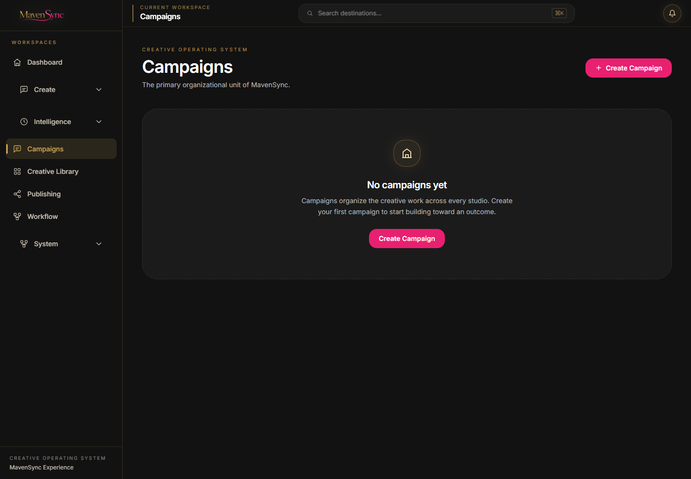
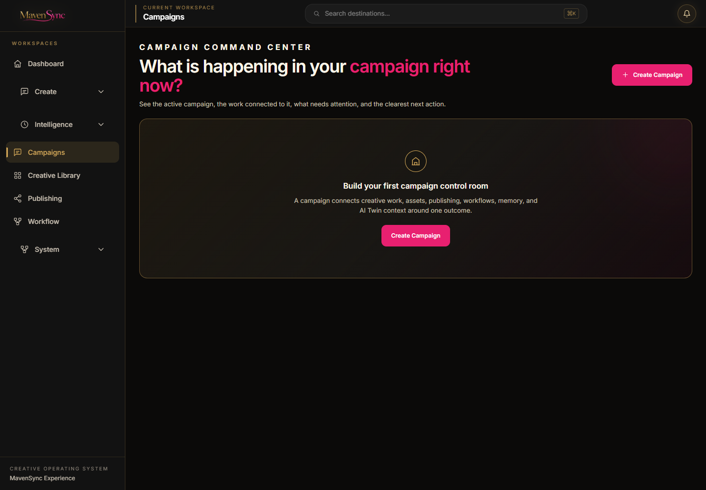
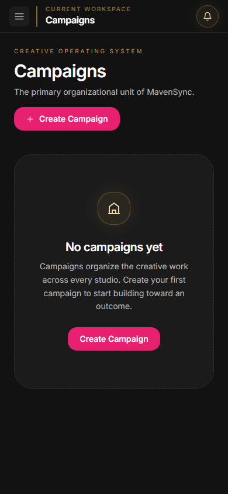
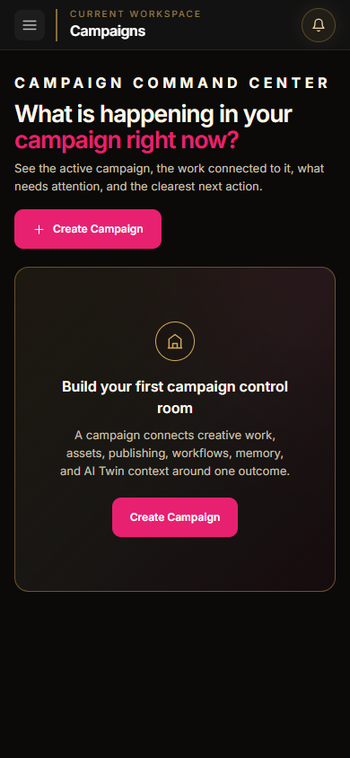

# MavenSync Creative OS - Experience Layer Sprint 5

## Campaign Command Center Experience

- Date: 2026-08-05
- Repository: `open-generative-ai`
- Branch: `mavensync-integration`
- Working directory: `C:\Users\Martha Newell\Downloads\AI-Apps\open-generative-ai`
- Status: Complete - awaiting approval before the next workspace

## Outcome

The existing Campaign Workspace is now a premium Campaign Command Center centered on one question: **What is happening in my campaign right now?** The active campaign is the clear focal point, while factual campaign work is organized into Continue Working, Campaign Assets, Publishing Status, Workflow, Campaign Context, Recent Activity, and Campaign Portfolio.

This sprint changes presentation and information hierarchy only. No campaign, intelligence, publishing, workflow, persistence, provider, or routing business logic was changed.

## Before and After

The browser profile contained no campaign records during screenshot capture, so both before and after evidence show the real empty state. No sample campaign, asset, activity, metric, or integration data was fabricated.

| Viewport | Before | After |
| --- | --- | --- |
| Desktop |  |  |
| Mobile |  |  |

## Experience Decisions

- Made the current campaign hero the primary visual anchor, with its real status, description, asset count, attention count, and last-updated date.
- Derived the suggested next action from existing campaign data: create the first asset, review real publishing drafts, prepare publishing, or review campaign assets.
- Kept Continue Working honest by using the most recent persisted asset, publishing record, AI Twin conversation, Agent conversation, or memory record connected to the campaign.
- Organized supporting information by decision value instead of presenting disconnected statistics.
- Kept campaign switching visible but secondary in a Campaign Portfolio below the command center.
- Added explicit empty states wherever persisted campaign data is absent.
- Preserved the existing create-campaign flow and restyled only its presentation.
- Used responsive grids and compact mobile stacking to retain hierarchy without nested menus.

## Existing Functionality Preserved

- `CampaignStore` create, list, active-id, and update behavior remains unchanged.
- `CampaignContext` remains the sole active-campaign authority; campaign switching still calls the existing context setter.
- Campaign metadata and asset ownership continue to use the existing `assetCampaignInfo` helpers.
- Existing campaign-owned assets remain in their current canonical and legacy stores; no assets were moved or rewritten.
- Publishing status is read from the existing draft and history stores and filtered to the active campaign.
- Workflow information is surfaced only when existing campaign-owned workflow output is present.
- AI Twin and Agent conversations and Creative Memory entries are read from their existing stores and filtered by campaign context.
- Continue Working is derived from actual persisted records and routes to the existing destination.
- Campaign creation, direct routes, shell navigation, and Command Bar behavior are unchanged.
- AI Twin logic, Agent runtime, Creative Intelligence Engine, Provider Registry, Campaign Context, asset persistence, publishing logic, workflow logic, and asset ownership were not modified.

## Shared Components Reused

- `ExperiencePage`
- `WorkspaceHeader`
- `WorkspaceHero`
- `WorkspaceSection`
- `WorkspaceCard`
- `PrimaryButton`
- `SecondaryButton`
- `StatusBadge`
- `EmptyState`
- `LoadingState`

These Sprint 1 primitives carry the matte-black canvas, charcoal surfaces, metallic-gold structure, MavenSync pink actions, typography, spacing, focus treatment, and restrained motion established across Sprints 2-4.

## Accessibility Validation

- The page retains one descriptive `h1` and a logical section-heading hierarchy.
- Current campaign summary has an accessible group label.
- Campaign portfolio options use real buttons and expose `aria-pressed` for the active campaign.
- All launch actions remain keyboard-operable native buttons.
- Visible focus behavior comes from the shared Experience Layer components.
- Image previews use their existing asset title as alternative text.
- Empty-state and status information is conveyed in text, not color alone.
- Desktop and 390px mobile layouts were reviewed in a real Chromium session.
- The mobile navigation control remained available and the desktop Command Bar opened with `Control+K`.

## Validation

| Check | Result |
| --- | --- |
| Repository test suite | Pass - 710/710 tests |
| Studio package build | Pass - 302 files compiled with Babel |
| Production build | Pass - optimized Next.js build completed |
| Campaign creation | Pass - existing modal created records through `CampaignStore` |
| Campaign switching | Pass - two temporary QA records switched active Campaign Context correctly; both were removed after validation |
| Campaign routes | Pass - `/studio/campaigns` returned HTTP 200 |
| Connected routes | Pass - Creative Library, Publishing, Workflows, AI Twin, and Creative Memory returned HTTP 200 |
| Command Bar | Pass - `Control+K` opened the existing destination list |
| Responsive presentation | Pass - desktop and mobile browser review completed |
| Browser console | Pass - 0 errors, 0 warnings |
| Data integrity | Pass - screenshots and empty states use real persisted state; no demo data remains |

## Files Changed for Sprint 5

- `packages/studio/src/components/CampaignWorkspace.jsx`
- `packages/studio/src/components/CampaignDashboard.jsx`
- `docs/assets/experience-sprint5-campaign-before-desktop.png`
- `docs/assets/experience-sprint5-campaign-before-mobile.png`
- `docs/assets/experience-sprint5-campaign-after-desktop.png`
- `docs/assets/experience-sprint5-campaign-after-mobile.png`
- `docs/milestones/MILESTONE_2026-08-05_Experience_Layer_Sprint5_Campaign_Command_Center.md`
- `BUILD_STATUS.md`

## Definition of Done

- [x] Campaign Workspace reflects the approved MavenSync Experience Layer.
- [x] The current campaign is the single clear focal point.
- [x] Users can see what exists, what needs attention, and the next action without fabricated data.
- [x] Campaign creation, switching, context, asset metadata, Continue Working, publishing, workflow, memory, and AI integrations remain intact.
- [x] Existing routes and Command Bar behavior remain intact.
- [x] No business logic, persistence, provider, or ownership behavior changed.
- [x] Responsive and accessibility checks pass.
- [x] Browser console is clean.
- [x] Test suite, Studio build, and production build pass.
- [x] Before/after evidence is included.

## Recommended Git Commit Message

`feat(experience): redesign Campaign command center`

## Approval Gate

Sprint 5 is complete. Stop here and wait for approval before redesigning another workspace.
