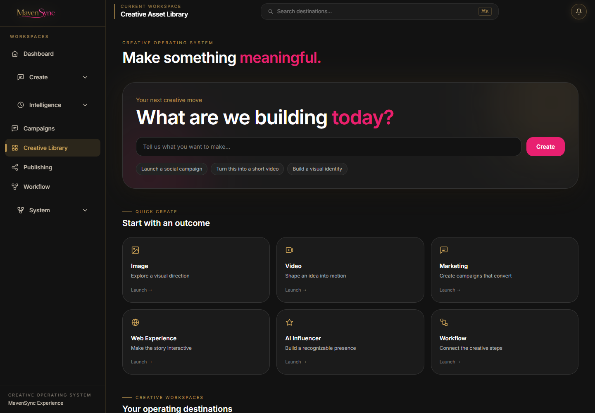
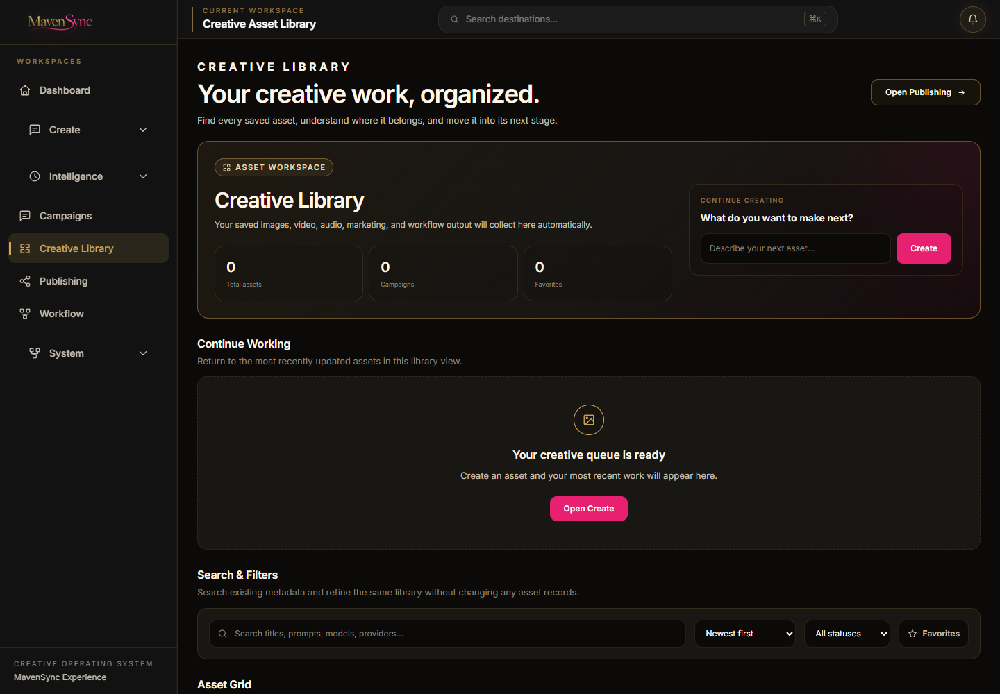
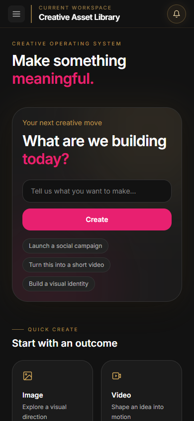
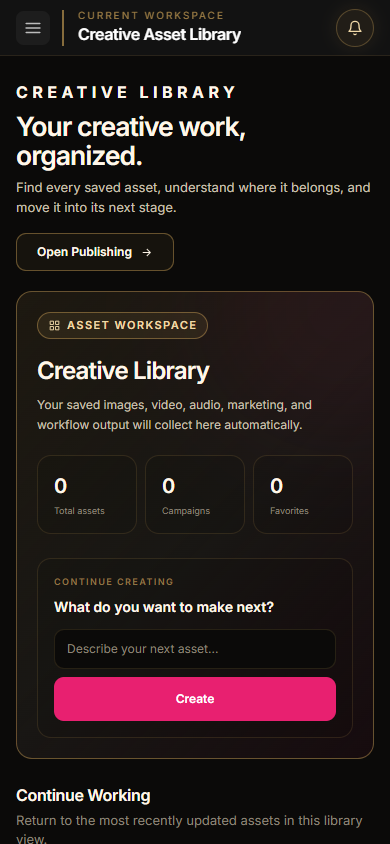

# MavenSync Creative OS - Experience Layer Sprint 6

## Creative Library Experience

- Date: 2026-08-05
- Repository: `open-generative-ai`
- Branch: `mavensync-integration`
- Working directory: `C:\Users\Martha Newell\Downloads\AI-Apps\open-generative-ai`
- Status: Complete - awaiting approval before the next workspace

## Outcome

The Creative Library is now a premium digital asset management workspace. It immediately explains what has been created, where assets belong, which campaign owns them, and what users can do next.

The sprint changes presentation and component-level view state only. The existing Asset Library service, storage adapter, asset schema, metadata, campaign ownership, publishing system, download manager, studio routes, and Command Bar remain unchanged.

## Before and After

The screenshot browser profile contained no saved assets, so the evidence shows the real empty state before and after. No assets or metrics were fabricated for screenshots.

| Viewport | Before | After |
| --- | --- | --- |
| Desktop |  |  |
| Mobile |  |  |

## Layout Decisions

- Replaced the broad workspace-launcher hierarchy with a focused Creative Library header and asset-management hero.
- Surfaced only real totals: assets in the current library scope, represented campaigns, and favorites.
- Preserved the existing prompt-to-studio handoff in a compact Continue Creating panel.
- Added Continue Working from the most recently updated stored assets.
- Built Asset Collections dynamically from existing asset-type metadata; no category names are invented.
- Presented search, sort, favorites, current/archived filtering, and metadata collections as one calm control surface.
- Expanded the grid from a six-item recent slice to every asset matching the existing service filters.
- Added a selected-asset details area with existing campaign, created date, model, provider, status, dimensions, preview, download, favorite, studio, and publishing information.
- Added honest empty and no-match states without generating demo content.

## Existing Functionality Preserved

- `AssetLibraryService.list`, `search`, sorting, metadata filters, favorites, archived state, and lineage remain unchanged.
- `localAssetManager` and its registered storage adapter remain the sole canonical asset persistence layer.
- Existing legacy studio-history ingestion remains enabled through the Asset Library service.
- Existing asset URLs and type metadata drive image, video, audio, and fallback previews.
- Downloads continue through the existing shared `downloadAsset` manager.
- Campaign scoping continues through the active `CampaignContext` and existing campaign metadata fields.
- Campaign identity is displayed from existing asset metadata or `CampaignStore`; asset records are not rewritten.
- The Publishing action continues to the existing `/studio/publishing` destination without creating or modifying drafts.
- Continue Working returns assets to their existing studio routes.
- The existing prompt handoff continues to route to Image, Video, Marketing, Workflow, or AI Influencer using the same local behavior.
- Routes, Command Bar behavior, storage keys, metadata schema, persistence, publishing logic, and integrations were not modified.

## Shared Components Reused

- `ExperiencePage`
- `WorkspaceHeader`
- `WorkspaceHero`
- `WorkspaceSection`
- `WorkspaceCard`
- `PrimaryButton`
- `SecondaryButton`
- `StatusBadge`
- `EmptyState`
- `LoadingState`
- `ErrorState`

These primitives apply the matte-black canvas, charcoal panels, metallic-gold hierarchy, MavenSync pink actions, compact typography, spacing, focus treatment, and restrained motion established in Sprints 1-5.

## Accessibility Validation

- The workspace has one descriptive `h1` and a logical section-heading structure.
- Search and both select controls have programmatic labels.
- Collection, favorite, and asset selection controls expose `aria-pressed`.
- Image previews use the stored asset title as alternative text.
- Video and audio previews have accessible labels and native controls.
- Metadata is presented as a semantic description list.
- Empty, loading, error, selection, favorite, and campaign states include text and do not rely on color alone.
- Shared focus styles and native keyboard controls remain intact.
- Desktop and 390px mobile views were reviewed in Chromium.

## Validation

| Check | Result |
| --- | --- |
| Repository test suite | Pass - 710/710 tests |
| Studio package build | Pass - 302 files compiled with Babel |
| Production build | Pass - optimized Next.js build completed |
| Production routes | Pass - Creative Library, Publishing, Create, Image, and Video returned HTTP 200 |
| Asset previews | Pass - same-origin image preview rendered with accessible text; video/audio use native preview controls when their stored URLs exist |
| Search | Pass - title query reduced the QA library to the matching asset |
| Filters | Pass - asset type, favorites, archived/current, and clear-filter behavior verified |
| Sorting | Pass - existing service sort options remain exposed |
| Downloads | Pass - shared download manager produced `Summer-Launch-Hero-sprint6-qa-image.jpg` from a same-origin QA asset |
| Campaign ownership | Pass - active campaign scoped three QA assets to the two owned assets; clearing scope restored all three |
| Publishing integration | Pass - Library action reached `/studio/publishing` |
| Command Bar | Pass - `Control+K` opened the existing destinations |
| Responsive presentation | Pass - desktop and mobile review completed |
| Browser console | Pass - 0 errors, 0 warnings in the representative same-origin validation session |
| QA data cleanup | Pass - temporary assets and campaign were removed and the prior browser state restored |

## Files Changed for Sprint 6

- `packages/studio/src/components/AssetLibraryStudio.jsx`
- `docs/assets/experience-sprint6-library-before-desktop.png`
- `docs/assets/experience-sprint6-library-before-mobile.png`
- `docs/assets/experience-sprint6-library-after-desktop.png`
- `docs/assets/experience-sprint6-library-after-mobile.png`
- `docs/milestones/MILESTONE_2026-08-05_Experience_Layer_Sprint6_Creative_Library.md`
- `BUILD_STATUS.md`

## Definition of Done

- [x] Creative Library reflects the MavenSync Experience Layer.
- [x] Real totals, ownership, recent work, and next actions are clear.
- [x] Existing previews, search, sorting, filtering, favorites, archive visibility, downloads, metadata, campaign ownership, publishing navigation, and studio return routes remain accessible.
- [x] No storage, persistence, metadata, publishing, route, or integration logic changed.
- [x] Asset Collections are derived only from existing metadata.
- [x] Responsive and accessibility checks pass.
- [x] Browser console is clean.
- [x] Tests, Studio build, and production build pass.
- [x] Before/after evidence is included.

## Recommended Git Commit Message

`feat(experience): redesign Creative Library workspace`

## Approval Gate

Sprint 6 is complete. Stop here and wait for approval before redesigning another workspace.
