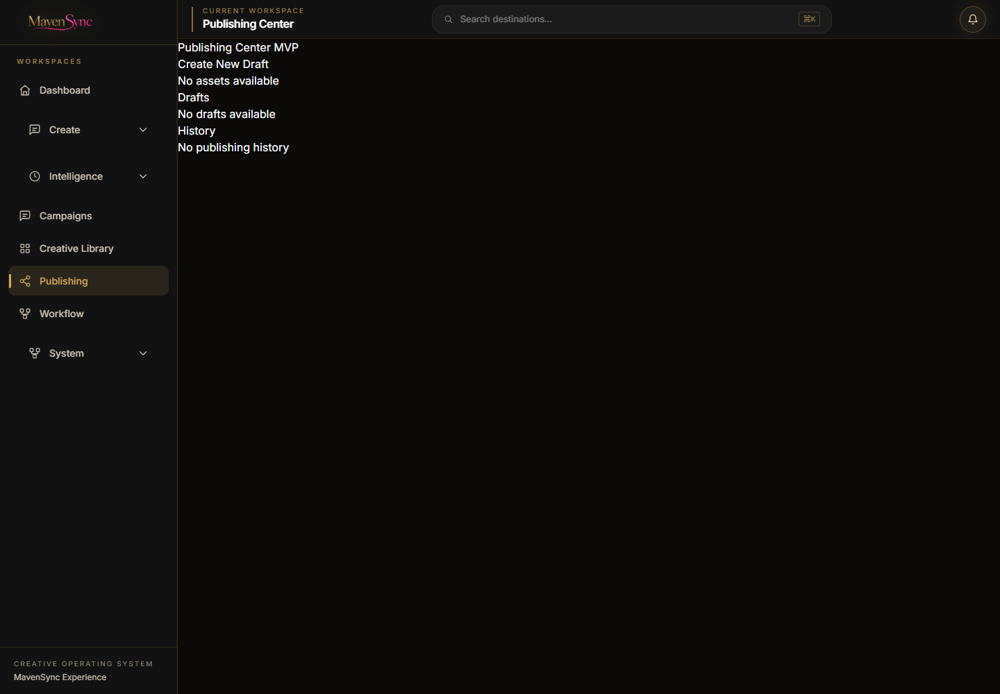
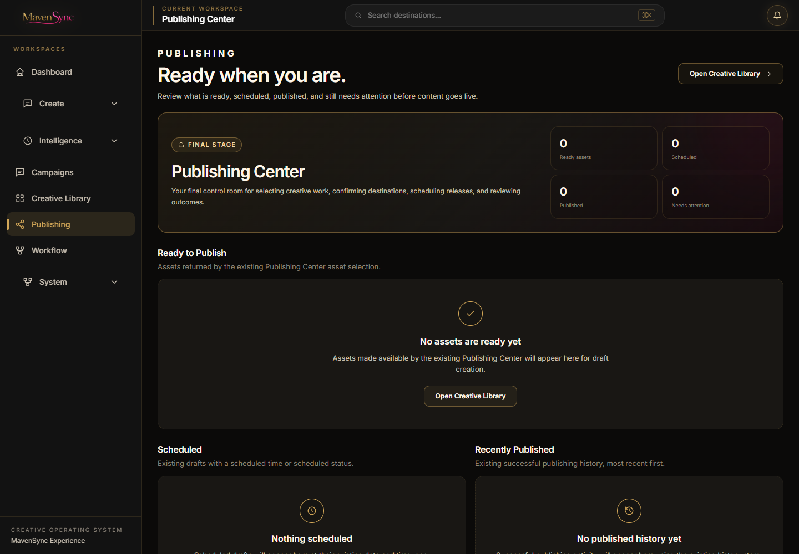
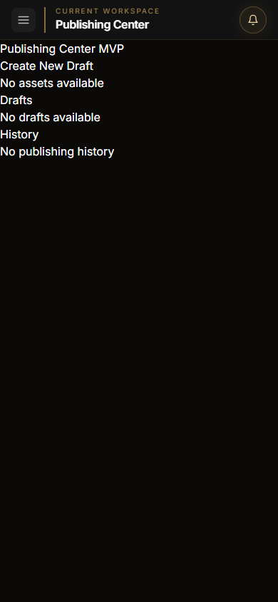
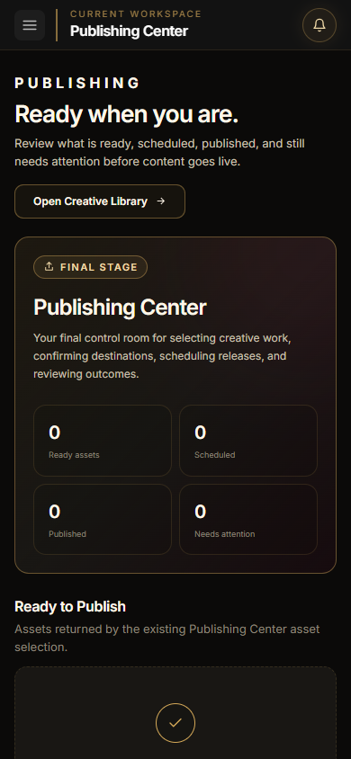

# MavenSync Creative OS - Experience Layer Sprint 7

## Publishing Experience

- Date: 2026-08-05
- Repository: `open-generative-ai`
- Branch: `mavensync-integration`
- Working directory: `C:\Users\Martha Newell\Downloads\AI-Apps\open-generative-ai`
- Status: Complete - awaiting approval before the next workspace

## Outcome

The Publishing Workspace is now a premium final-stage command center. It answers what is ready, scheduled, already published, and still needs attention while keeping the existing Publishing Center actions together in one calm workspace.

This sprint changes presentation and component-level view state only. Publishing drafts, scheduling, immediate publishing, provider calls, history persistence, Campaign ownership, asset selection, routes, integrations, and Command Bar behavior remain on their existing implementations.

## Before and After

The screenshot browser profile contained no saved publishing records, so the evidence shows the real empty state before and after. No assets, drafts, history, accounts, or metrics were fabricated for screenshots.

| Viewport | Before | After |
| --- | --- | --- |
| Desktop |  |  |
| Mobile |  |  |

## Experience Decisions

- Established one clear Publishing Center hero with real counts for ready assets, scheduled drafts, successful history, and drafts needing attention.
- Surfaced the active Campaign Context using the existing campaign provider without creating or changing ownership data.
- Presented assets returned by the existing Publishing Center as visual Ready to Publish cards with the existing Create Draft action.
- Separated Scheduled and Recently Published records so users can distinguish future work from completed outcomes immediately.
- Summarized only platform destinations already present in existing drafts or history; no future platforms, accounts, or connection state are invented.
- Reorganized the Publishing Queue around status, Campaign ownership, assets, schedule, timezone, errors, platform selection, and the existing Publish, Schedule, and Delete actions.
- Preserved factual empty, loading, error, and unsupported-provider states.
- Kept technical implementation details out of the launcher while retaining useful provider errors on the affected draft.

## Existing Functionality Preserved

- `PublishingCenterMVP` remains the sole UI-facing Publishing Center orchestration object.
- Asset selection continues through `getAvailableAssets` and draft creation through `createDraftFromAsset`.
- Platform changes continue through `updateDraftPlatforms` using the existing seven registered destinations.
- Scheduling continues through `scheduleDraft`; immediate publishing continues through `publishDraft`.
- Draft removal continues through the existing `deleteDraft` implementation.
- Draft and job normalization, validation, persistence, status mapping, provider execution, and MavenSync status reporting were not changed.
- Existing publishing history and scheduled state are read from the current storage abstractions.
- Campaign ownership continues to come from existing asset and Campaign Context metadata.
- Existing Publishing, Creative Library, Campaign, Create, and Intelligence routes remain unchanged and reachable.
- Command Bar registration and keyboard behavior remain unchanged.
- No provider account connection, publishing workflow, scheduling, execution, route, persistence, asset ownership, or business logic was added or modified.

## Shared Components Reused

- `ExperiencePage`
- `WorkspaceHeader`
- `WorkspaceHero`
- `WorkspaceSection`
- `WorkspaceCard`
- `PrimaryButton`
- `SecondaryButton`
- `StatusBadge`
- `EmptyState`
- `LoadingState`
- `ErrorState`

These shared primitives carry forward the matte-black canvas, charcoal surfaces, metallic-gold structure, MavenSync pink actions, compact typography, premium spacing, focus treatment, and restrained motion established in Sprints 1-6.

## Accessibility Validation

- The workspace has one descriptive `h1` and a logical section-heading hierarchy.
- Publishing totals have a programmatic summary label.
- Platform choices remain native checkboxes inside a named fieldset.
- Buttons expose disabled and busy states through native semantics and visible text.
- Asset previews use existing asset titles as alternative text; video previews have accessible labels.
- Status, schedule, campaign, empty, error, and success information is conveyed with text and does not rely on color alone.
- Notices use a live status region.
- Shared visible-focus and reduced-motion behavior remain intact.
- Desktop and 390px mobile layouts were reviewed in Chromium.

## Validation

| Check | Result |
| --- | --- |
| Repository test suite | Pass - 710/710 tests |
| Studio package build | Pass - 302 files compiled with Babel |
| Production build | Pass - optimized Next.js build completed |
| Production routes | Pass - Publishing, Creative Library, Campaigns, Create, and Intelligence returned HTTP 200 |
| Ready asset selection | Pass - a temporary browser-only stored asset appeared and created a draft through the existing action |
| Campaign integration | Pass - the active Campaign appeared in the header, context banner, asset, and created draft ownership |
| Platform selection | Pass - the existing Instagram destination checkbox updated the draft and attention state |
| Scheduling | Pass - the existing Schedule Tomorrow action completed against a browser-intercepted provider contract and surfaced the scheduled draft |
| Publishing history | Pass - existing successful history appeared in Recently Published and contributed its real platform destination |
| Asset ownership | Pass - the queue retained the asset and Campaign metadata created by the existing Publishing Center |
| Command Bar | Pass - `Control+K` opened the existing destination list, including Publishing |
| Responsive presentation | Pass - desktop and mobile review completed |
| Browser console | Pass - 0 errors and 0 warnings in the final clean production session |
| QA data cleanup | Pass - temporary asset, draft, history, and Campaign records were removed and prior browser state restored |
| Diff hygiene | Pass - `git diff --check` reports no whitespace errors |

## Files Changed for Sprint 7

- `packages/studio/src/components/PublishingStudio.jsx`
- `docs/assets/experience-sprint7-publishing-before-desktop.png`
- `docs/assets/experience-sprint7-publishing-before-mobile.png`
- `docs/assets/experience-sprint7-publishing-after-desktop.png`
- `docs/assets/experience-sprint7-publishing-after-mobile.png`
- `docs/milestones/MILESTONE_2026-08-05_Experience_Layer_Sprint7_Publishing.md`
- `BUILD_STATUS.md`

## Definition of Done

- [x] Publishing visually reflects the MavenSync Experience Layer.
- [x] Ready, scheduled, published, and attention states are immediately understandable.
- [x] Existing asset selection, draft, platform, scheduling, publishing, history, Campaign, and provider capabilities remain accessible.
- [x] No publishing workflow, provider integration, scheduling, execution, persistence, route, Command Bar, or business logic changed.
- [x] Only real stored information and factual empty states are presented.
- [x] Responsive and accessibility checks pass.
- [x] Browser console is clean.
- [x] Tests, Studio build, and production build pass.
- [x] Before/after evidence is included.

## Recommended Git Commit Message

`feat(experience): redesign Publishing command center`

## Approval Gate

Sprint 7 is complete. Stop here and wait for approval before redesigning another workspace.
