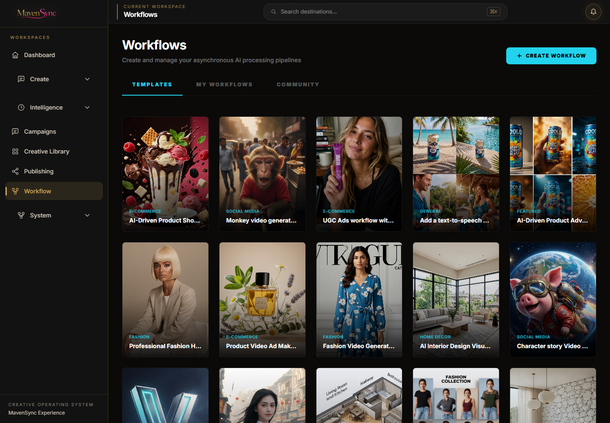
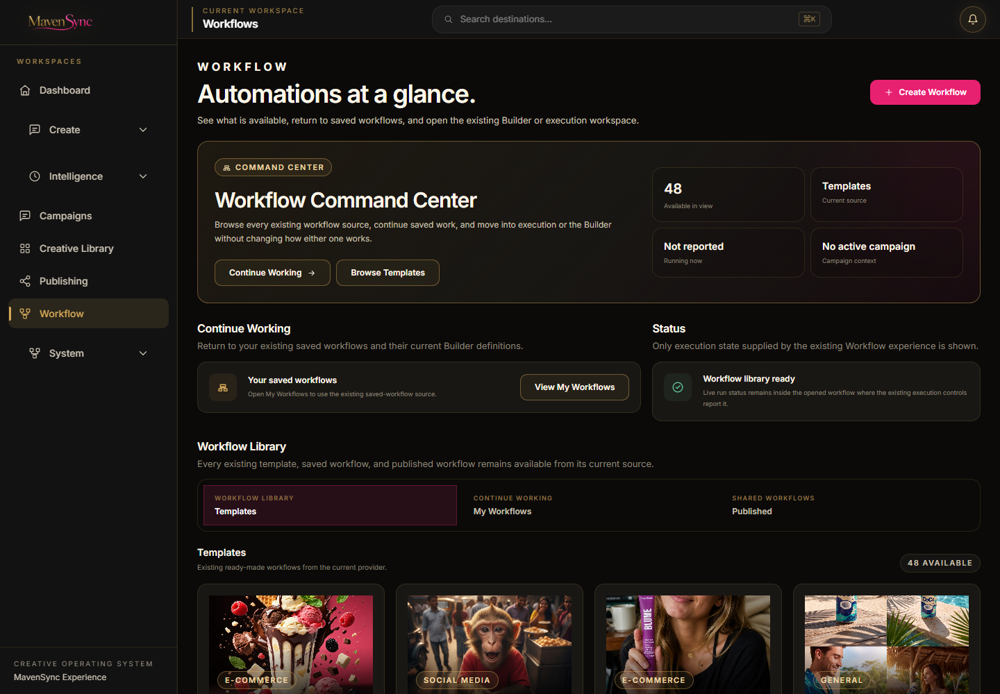
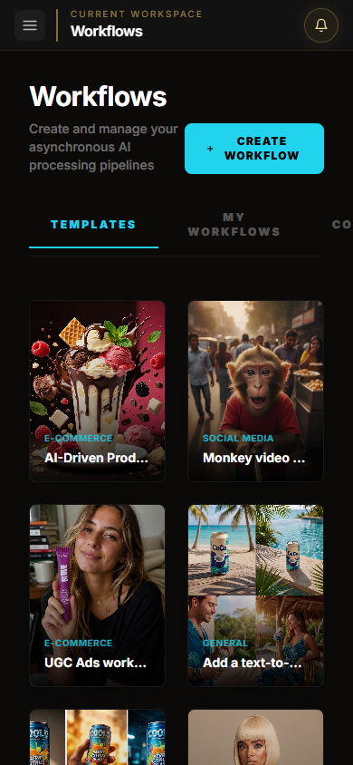
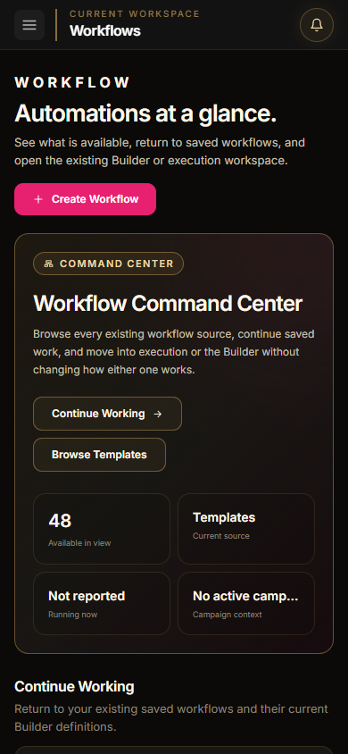

# MavenSync Creative OS - Experience Layer Sprint 8

## Workflow Command Center

- Date: 2026-08-05
- Repository: `open-generative-ai`
- Branch: `mavensync-integration`
- Working directory: `C:\Users\Martha Newell\Downloads\AI-Apps\open-generative-ai`
- Status: Complete - awaiting approval before the next workspace

## Outcome

The Workflow workspace is now a premium command center that makes the existing template library, saved workflows, published workflows, Builder entry points, execution workspace, and Campaign Context easier to understand without changing how any workflow is defined or executed.

The redesign is limited to the launcher presentation. Workflow provider methods, template definitions, saved data, routing, creation, rename/delete operations, node schemas, Playground execution, Builder rendering, result handling, Campaign asset registration, and automation behavior remain on their existing implementations.

## Before and After

Both screenshots use the real provider response: 48 templates were available during validation. No workflows, execution states, history, or metrics were fabricated.

| Viewport | Before | After |
| --- | --- | --- |
| Desktop |  |  |
| Mobile |  |  |

## Required UX Audit

| Finding | Presentation response |
| --- | --- |
| The generic `Workflows` heading did not answer what is available or running. | Added a Workflow Command Center hero with the current source, real available count, Campaign Context, and an honest `Not reported` running state. |
| Templates, saved workflows, and published workflows appeared as three disconnected tabs without explaining their relationship. | Presented them as three labeled sources inside one Workflow Library: Templates, My Workflows, and Published. |
| `Community` in the launcher and `published` in state/provider naming were inconsistent. | The launcher now uses `Published`, matching the existing data source. No route or provider name changed. |
| The opened-workflow interface uses `Full Workflow`, `Builder`, and `Play`/`Playground` for related destinations. | Documented only. Changing certified workflow-internal labels was outside this presentation-only launcher sprint. |
| Workflow cards emphasized thumbnails and categories but buried descriptions and the launch action. | Cards now show existing name, category, description when present, version/node information when reliably available, and a clear Open action. |
| Saved work was buried behind a tab with no Continue Working context. | Added a Continue Working destination; when My Workflows is active it surfaces the first two existing saved workflows without changing their ordering or data. |
| A full-page loading spinner delayed all orientation until the provider returned. | The command-center hierarchy remains visible while the existing source loads, with a scoped loading state in the Workflow Library. |
| There is no launcher-level cross-workflow execution history feed. | Added an explicit empty state explaining that live status and results remain inside an opened workflow. No activity was invented. |
| Creating, finding saved work, and understanding the difference between Builder and execution required scanning multiple unrelated controls. | Grouped the existing Create Workflow, Continue Working, Browse Templates, source tabs, and card Open actions into a clear hierarchy. |

## Layout Decisions

- Made `Automations at a glance` the page-level orientation and Workflow Command Center the visual focal point.
- Used only the active provider response for the available count; the value changes with Templates, My Workflows, and Published.
- Marked running status as `Not reported` because the existing launcher does not expose a cross-workflow run-status collection.
- Preserved the active Campaign name when it exists and otherwise shows a factual no-context state.
- Added Quick Actions using only existing actions: Create Workflow, Continue Working, and Browse Templates.
- Presented Continue Working, Status, Workflow Library, and Recent Activity in that order to answer availability and next action before the full catalog.
- Reduced card density from six narrow portrait columns to four readable landscape cards on wide screens.
- Kept rename and delete actions limited to My Workflows and published author information limited to existing published records.
- Left the selected workflow Playground and Builder presentation untouched.

## Existing Functionality Preserved

- Template loading still uses `getNormalizedWorkflowTemplates` with the existing raw-template fallback.
- My Workflows still uses `getUserWorkflows`; Published still uses `getPublishedWorkflows`.
- Create Workflow still uses `createWorkflow` and routes new workflows to the existing Playground.
- Workflow selection still uses the same content-aware Playground/Builder routing.
- Rename and delete continue through `updateWorkflowName` and `deleteWorkflow`.
- Workflow inputs, node schemas, and definitions still load through the existing provider registry.
- Execution continues through `executeWorkflowStudioRuntime` and `executeNormalizedWorkflow`.
- Campaign metadata and MavenSync asset registration remain unchanged.
- `WorkflowUI` still mounts the existing `WorkflowBuilder` with the same workflow ID, node schemas, initial definition, cost type, and back route.
- Existing `/studio/workflows`, `/workflow/[id]`, `/workflow/[id]/builder`, and `/workflow/[id]/playground` routes remain unchanged.
- Provider Registry, workflow definitions, persistence, Command Bar, automation behavior, and backend APIs were not modified.
- All 48 provider templates and all seven saved workflows returned during QA remained accessible from their existing sources.

## Shared Components Reused

- `ExperiencePage`
- `WorkspaceHeader`
- `WorkspaceHero`
- `WorkspaceSection`
- `WorkspaceCard`
- `PrimaryButton`
- `SecondaryButton`
- `StatusBadge`
- `EmptyState`
- `LoadingState`
- `ErrorState`

These components carry forward the matte-black canvas, charcoal surfaces, metallic-gold structure, MavenSync pink actions, premium typography, spacing, focus treatment, and restrained motion established in Sprints 1-7.

## Accessibility Validation

- The launcher has one descriptive `h1` followed by a logical section-heading hierarchy.
- Workflow sources use a named tab list with `role="tab"` and `aria-selected`.
- Workflow cards use native buttons and expose their name, description, metadata, and Open intent to assistive technology.
- Decorative card images use empty alternative text because the workflow name is already present in the button label.
- My Workflows option buttons have workflow-specific accessible names and expanded state.
- Continue Working actions have workflow-specific accessible names.
- Loading, empty, error, status, Campaign, and execution-history-unavailable states include text and do not rely on color alone.
- Shared visible-focus and reduced-motion behavior remain intact.
- Desktop and 390px mobile views were reviewed in Chromium.

## Validation

| Check | Result |
| --- | --- |
| Repository test suite | Pass - 710/710 tests |
| Workflow execution tests | Pass - definition, engine, runtime, provider, polling, output asset, and integration coverage included in the 710-test run |
| Studio package build | Pass - 302 files compiled with Babel |
| Production build | Pass - optimized Next.js build completed |
| Workflow launcher route | Pass - `/studio/workflows` returned HTTP 200 |
| Workflow detail routes | Pass - `/workflow/[id]`, `/workflow/[id]/builder`, and `/workflow/[id]/playground` route forms returned HTTP 200 |
| Existing templates | Pass - 48 real templates rendered from the existing provider source |
| Saved workflows | Pass - all seven real My Workflows records rendered; Continue Working surfaced the first two in existing order |
| Published source | Preserved - existing source, provider method, and accessible Published tab remain unchanged |
| Builder | Preserved - `WorkflowUI`/`WorkflowBuilder` props and route wiring are unchanged; route and workflow integration tests pass |
| Execution | Preserved - Playground execution handler and runtime/provider calls are unchanged; execution tests pass |
| Rename/delete | Preserved - existing My Workflows actions remain accessible through named option controls |
| Command Bar | Pass - registry tests pass and no Command Bar code changed |
| Responsive presentation | Pass - desktop and mobile review completed |
| Browser console | Pass - 0 errors and 0 warnings during Templates and My Workflows QA |
| Diff hygiene | Pass - `git diff --check` reports no whitespace errors |

The final automated click from a saved workflow into the detail UI could not be completed because the browser automation allowance was exhausted after source-tab validation. No workaround was used. Builder and execution confidence is instead supported by unchanged component wiring, HTTP 200 route checks, successful production compilation, and the passing workflow-specific tests.

## Files Changed for Sprint 8

- `packages/studio/src/components/WorkflowStudio.jsx`
- `docs/assets/experience-sprint8-workflow-before-desktop.png`
- `docs/assets/experience-sprint8-workflow-before-mobile.png`
- `docs/assets/experience-sprint8-workflow-after-desktop.png`
- `docs/assets/experience-sprint8-workflow-after-mobile.png`
- `docs/milestones/MILESTONE_2026-08-05_Experience_Layer_Sprint8_Workflow_Command_Center.md`
- `BUILD_STATUS.md`

## Definition of Done

- [x] Workflow launcher visually reflects the MavenSync Experience Layer.
- [x] Existing Templates, My Workflows, and Published sources remain available.
- [x] Existing Workflow Builder, Playground, execution, creation, rename/delete, provider, Campaign, persistence, and route wiring remain intact.
- [x] No workflow definition, business logic, provider, automation behavior, route, or backend API changed.
- [x] Available counts and Campaign Context use only real data.
- [x] Missing run history and running status are presented honestly without fabricated activity.
- [x] Responsive and accessibility checks pass.
- [x] Browser console is clean.
- [x] Tests, Studio build, and production build pass.
- [x] Before/after evidence and UX audit findings are included.

## Recommended Git Commit Message

`feat(experience): redesign Workflow command center`

## Approval Gate

Sprint 8 is complete. Stop here and wait for approval before redesigning another workspace.
